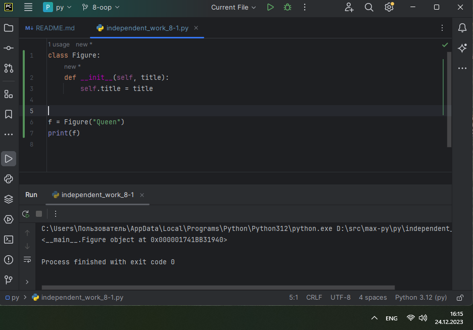
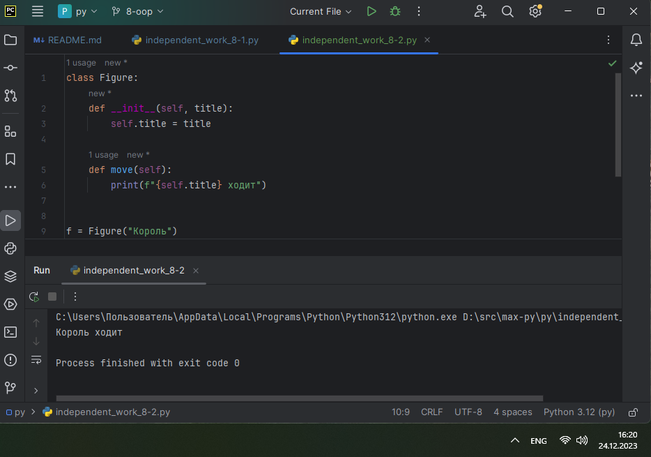
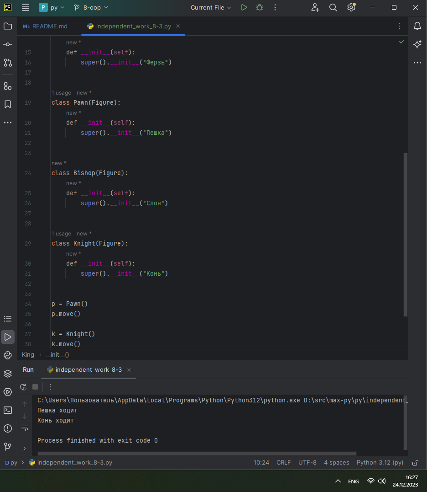
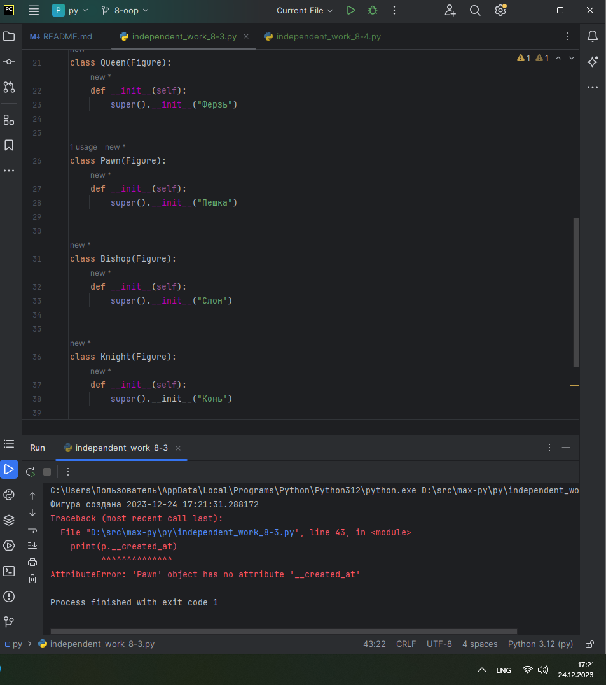
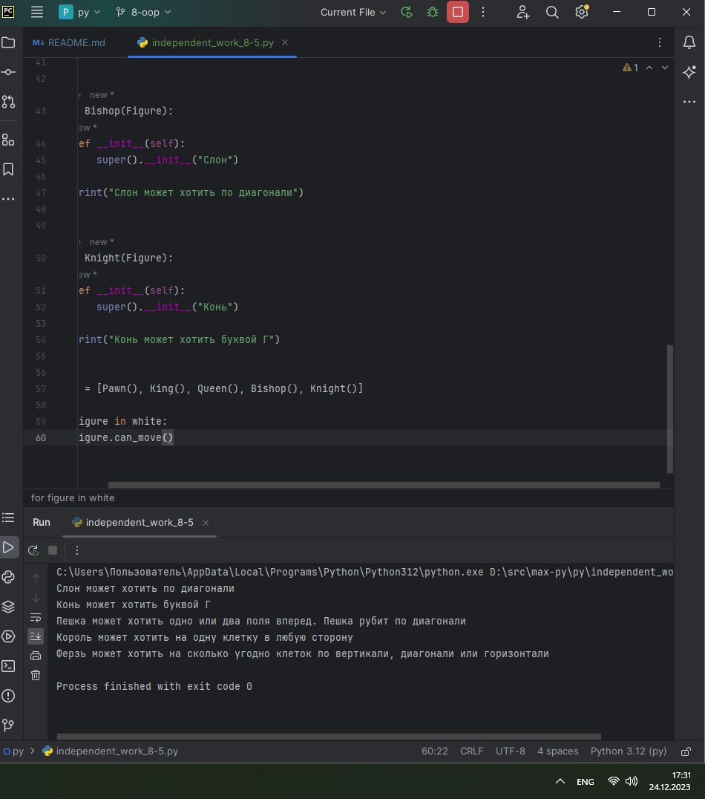

# ТЕМА 8. Введение в ООП

| Задание     | лаб. раб. | сам. раб. |
|-------------|-----------|-----------|
| Задание 1   | +         | +         |
| Задание 2   | +         | +         |
| Задание 3   | +         | +         |
| Задание 4   | +         | +         |
| Задание 5   | +         | +         |


Отчет по Теме #8 выполнил:
* Василько Максим Викторович
* ОЗИВТ-22-1-у

## Лабораторная работа №1
_Создайте класс “Car” с атрибутами производитель и модель. Создайте
объект этого класса. Напишите комментарии для кода, объясняющие
его работу. Результатом выполнения задания будет листинг кода с
комментариями._


## Лабораторная работа №2
_Дополните код из первого задания, добавив в него атрибуты и методы
класса, заставьте машину “поехать”. Напишите комментарии для кода,
объясняющие его работу. Результатом выполнения задания будет
листинг кода с комментариями и получившийся вывод в консоль._
 


## Лабораторная работа №3
_Создайте новый класс “ElectricCar” с методом “charge” и атрибутом
емкость батареи. Реализуйте его наследование от класса, созданного в
первом задании. Заставьте машину поехать, а потом заряжаться.
Напишите комментарии для кода, объясняющие его работу.
Результатом выполнения задания будет листинг кода с комментариями
и получившийся вывод в консоль._


## Лабораторная работа №4
_Реализуйте инкапсуляцию для класса, созданного в первом задании.
Создайте защищенный атрибут производителя и приватный атрибут
модели. Вызовите защищенный атрибут и заставьте машину поехать.
Напишите комментарии для кода, объясняющие его работу.
Результатом выполнения задания будет листинг кода с комментариями
и получившийся вывод в консоль._


## Лабораторная работа №5
_Реализуйте полиморфизм создав основной (общий) класс “Shape”, а
также еще два класса “Rectangle” и “Circle”. Внутри последних двух
классов реализуйте методы для подсчета площади фигуры. После этого
создайте массив с фигурами, поместите туда круг и прямоугольник,
затем при помощи цикла выведите их площади. Напишите
комментарии для кода, объясняющие его работу. Результатом
выполнения задания будет листинг кода с комментариями и
получившийся вывод в консоль._


## Самостоятельная работа №1
_Самостоятельно создайте класс и его объект. Они должны
отличаться, от тех, что указаны в теоретическом материале
(методичке) и лабораторных заданиях. Результатом выполнения
задания будет листинг кода и получившийся вывод консоли._

```
class Figure:
    def __init__(self, title):
        self.title = title


f = Figure("Queen")
print(f)
```


### _Результат:_


### _Выводы:_
_В данном коде создается объект класса Figure со свойством тайтл. В создаваемом объекте задается наименование - Queen_


## Самостоятельная работа №2
_Самостоятельно создайте атрибуты и методы для ранее созданного
класса. Они должны отличаться, от тех, что указаны в
теоретическом материале (методичке) и лабораторных заданиях.
Результатом выполнения задания будет листинг кода и
получившийся вывод консоли._

```
 class Figure:
    def __init__(self, title):
        self.title = title

    def move(self):
        print(f"{self.title} ходит")


f = Figure("Король")
f.move()
```

### _Результат:_


### _Выводы:_
_В данном коде свойство - title, и добавлен метод хода - move. Кодга мы вызываем метод move, в консоль выводится "Король ходит", где Король - заданный при содании атрибут наименования_

## Самостоятельная работа №3
_Самостоятельно реализуйте наследование, продолжая работать с
ранее созданным классом. Оно должно отличаться, от того, что
указано в теоретическом материале (методичке) и лабораторных
заданиях. Результатом выполнения задания будет листинг кода и
получившийся вывод консоли._

```
class Figure:
    def __init__(self, title):
        self.title = title

    def move(self):
        print(f"{self.title} ходит")


class King(Figure):
    def __init__(self):
        super().__init__("Король")


class Queen(Figure):
    def __init__(self):
        super().__init__("Ферзь")


class Pawn(Figure):
    def __init__(self):
        super().__init__("Пешка")


class Bishop(Figure):
    def __init__(self):
        super().__init__("Слон")


class Knight(Figure):
    def __init__(self):
        super().__init__("Конь")


p = Pawn()
p.move()

k = Knight()
k.move()
```

### _Результат:_


### _Выводы:_
_В данном коде создаются шахматные фигуры Конь Слон Король Ферзь и Пешка_

## Самостоятельная работа №4
_Самостоятельно реализуйте инкапсуляцию, продолжая работать с
ранее созданным классом. Она должна отличаться, от того, что
указана в теоретическом материале (методичке) и лабораторных
заданиях. Результатом выполнения задания будет листинг кода и
получившийся вывод консоли._

```
from datetime import datetime


class Figure:
    def __init__(self, title):
        self.title = title
        self.__created_at = datetime.now()

    def move(self):
        print(f"{self.title} ходит")

    def history(self):
        print(f"Фигура создана " + str(self.__created_at))


class King(Figure):
    def __init__(self):
        super().__init__("Король")


class Queen(Figure):
    def __init__(self):
        super().__init__("Ферзь")


class Pawn(Figure):
    def __init__(self):
        super().__init__("Пешка")


class Bishop(Figure):
    def __init__(self):
        super().__init__("Слон")


class Knight(Figure):
    def __init__(self):
        super().__init__("Конь")


p = Pawn()
p.history()
print(p.__created_at)
```

### _Результат:_


### _Выводы:_
_В данном коде добавлено приватное свойство со временем создания объекта. Метод history выводит дату создания, однако прямого доступа из объекта к этому свойству нет_

## Самостоятельная работа №5
_Самостоятельно реализуйте полиморфизм. Он должен отличаться,
от того, что указан в теоретическом материале (методичке) и
лабораторных заданиях. Результатом выполнения задания будет
листинг кода и получившийся вывод консоли.

```
from datetime import datetime


class Figure:
    def __init__(self, title):
        self.title = title
        self.__created_at = datetime.now()

    def move(self):
        print(f"{self.title} ходит")

    def history(self):
        print(f"Фигура создана " + str(self.__created_at))

    def can_move(self):
        pass


class King(Figure):
    def __init__(self):
        super().__init__("Король")

    def can_move(self):
        print("Король может хотить на одну клетку в любую сторону")


class Queen(Figure):
    def __init__(self):
        super().__init__("Ферзь")

    def can_move(self):
        print("Ферзь может хотить на сколько угодно клеток по вертикали, диагонали или горизонтали")


class Pawn(Figure):
    def __init__(self):
        super().__init__("Пешка")

    def can_move(self):
        print("Пешка может хотить одно или два поля вперед. Пешка рубит по диагонали")


class Bishop(Figure):
    def __init__(self):
        super().__init__("Слон")

    print("Слон может хотить по диагонали")


class Knight(Figure):
    def __init__(self):
        super().__init__("Конь")

    print("Конь может хотить буквой Г")


white = [Pawn(), King(), Queen(), Bishop(), Knight()]

for figure in white:
    figure.can_move()
```

### _Результат:_


### _Выводы:_
_В даном коде для каждой фигуры определен метод, с выводои информации в консоль как может ходить фигура_
