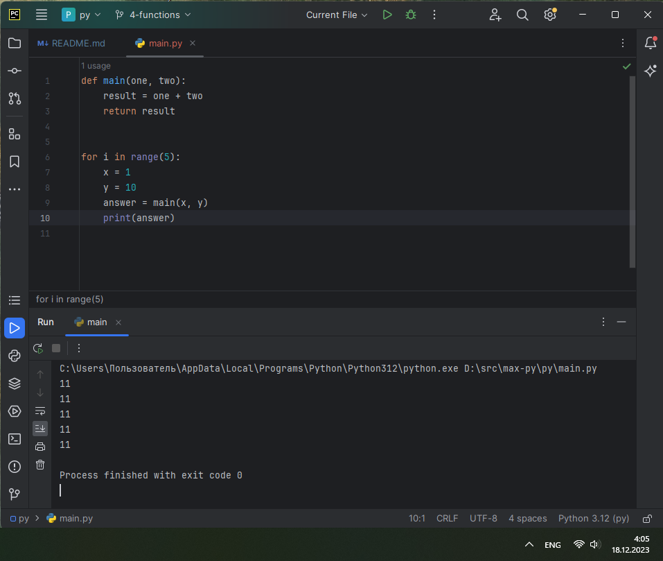
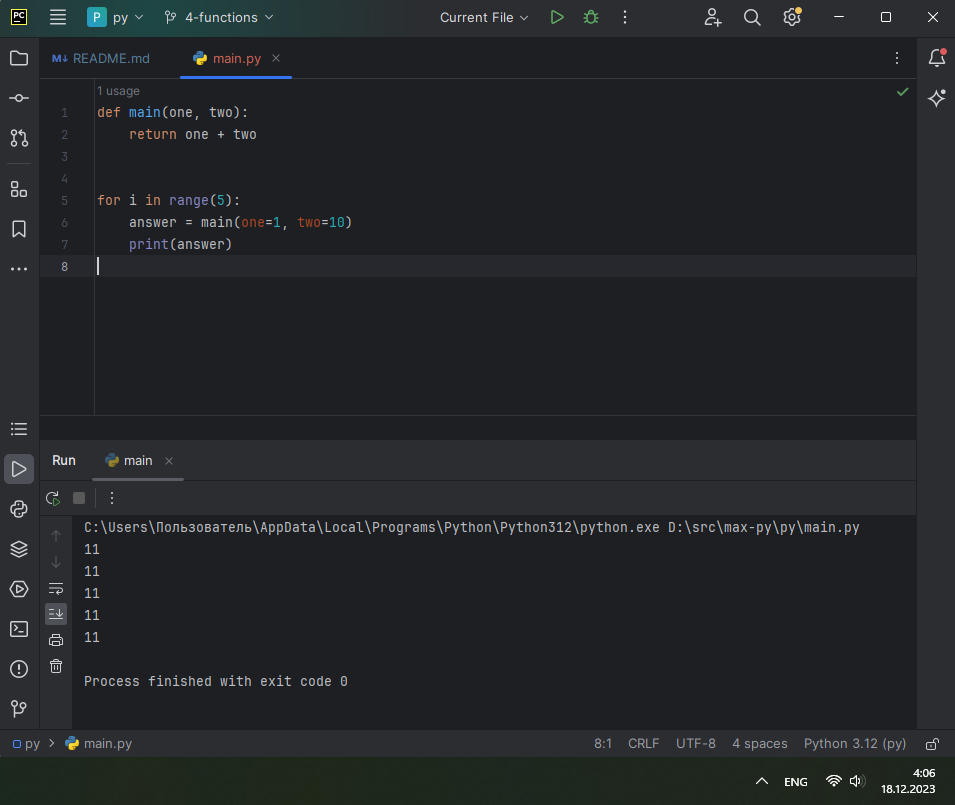

# ТЕМА 4. Функции и модули

| Задание     | лаб. раб. | сам. раб.  |
|-------------|-----------|------------|
| Задание 1   | +         | +          |
| Задание 2   | +         | +          |
| Задание 3   | +         | +          |
| Задание 4   | +         | +          |
| Задание 5   | +         | +          |
| Задание 6   | +         |            |
| Задание 7   | +         |            |
| Задание 8   | +         |            |
| Задание 9   | +         |            |
| Задание 10  | +         |            |

Отчет по Теме #4 выполнил:
* Василько Максим Викторович
* ОЗИВТ-22-1-у

## Лабораторная работа №1
_Напишите функцию, которая выполняет любые арифметические
действия и выводит результат в консоль. Вызовите функцию используя
“точку входа”._


## Лабораторная работа №2
_Напишите функцию, которая выполняет любые арифметические
действия, возвращает при помощи return значение в место, откуда
вызывали функцию. Выведите результат в консоль. Вызовите функцию
используя “точку входа”.
Ниже представлена точно такая же программа, как и выше, только
написана более развернуто. В это программе стоит заметить что
результат работы функции main() мы помещаем в переменную
“answer”, в дальнейшем можно как-то работать с ним, не вызывая
функцию повторно, что хорошо сказывается, например, на скорости
работы программ_


## Лабораторная работа №3
_Напишите функцию, в которую передаются два аргумента, над ними
производится арифметическое действие, результат возвращается туда,
откуда эту функцию вызывали. Выведите результат в консоль.
Вызовите функцию в любом небольшом цикле.
На скриншоте ниже приведен пример программы, в которой аргумент
функции “x“превращается в параметр “one”, то же самое происходит
с “y” и “two”_



_Ниже представлена точно такая же программа, как и выше, только
аргументы передаются в вызове функции, а не как отдельные
переменные._



## Лабораторная работа №4
_Напишите функцию, на вход которой подается какое-то изначальное
неизвестное количество аргументов, над которыми будет производится
арифметические действия. Для выполнения задания необходимо
использовать кортеж “*args”. На скриншоте ниже приведен пример
такой программы с комментариями.
Для закрепления понимания работы с кортежами настоятельно
рекомендуем поменять аргументы вызова функции, вручную посчитать
результат, только потом запустить программу с новыми значениями и
проверить себя, насколько вы поняли данный аспект
программирования._


## Лабораторная работа №5
_Напишите функцию, которая на вход получает кортеж “**kwargs” и
при помощи цикла выводит значения, поступившие в функцию. На
скриншоте ниже указаны два варианта вызова функции с “**kwargs” и
два варианта работы с данными, поступившими в эту функцию.
Комментарии в коде и теоретическая часть помогут вам разобраться в
этом нелегком аспекте. Вызовите функцию используя “точку входа”._


## Лабораторная работа №6
_Напишите две функции. Первая – получает в виде параметра
“**kwargs”. Вторая считает среднее арифметическое из значений
первой функции. Вызовите первую функцию используя “точку входа”
и минимум 4 аргумента._


## Лабораторная работа №7
_Создайте дополнительный файл .py. Напишите в нем любую функцию,
которая будет что угодно выводить в консоль, но не вызывайте ее в
нем. Откройте файл main.py, импортируйте в него функцию из нового
файла и при помощи “точки входа” вызовите эту функцию._


## Лабораторная работа №8
_Напишите программу, которая будет выводить корень, синус, косинус
полученного от пользователя числа.
На первом скриншоте мы просто импортировали модуль math целиком
и вызвали его длинным способом через math.название_фунции.
Также импорт стандартного модуля в python возможно осуществить и
другими способами, которые будут выполнять ту же самую функцию,
но синтаксис будет немного отличатся.
На втором скриншоте из модуля math мы загрузили в программу
только 3 необходимые функции и обращались к ним так, будто они
находятся у нас в файле просто через их название. Также замечу что
мы импортировали три функции в одну строку, что очень удобно.
На третьем скриншоте мы импортировали модуль math и при помощи
оператора * загрузили все его функции. По большому счеты мы
сделали то же самое что и на первом скриншоте, но у нас только
поменялся синтаксис вызова этих функций, он стал похож на вызов со
второго скриншота._


## Лабораторная работа №9
_Напишите программу, которая будет рассчитывать какой день недели
будет через n-нное количество дней, которые укажет пользователь.
В результате день недели указан в виде цифры, где 1 = понедельник, 2
= вторник, 3 = среда и так далее_


## Лабораторная работа №10
_Напишите программу с использованием глобальных переменных,
которая будет считать площадь треугольника или прямоугольника в
зависимости от того, что выберет пользователь. Получение всей
необходимой информации реализовать через input(), а подсчет
площадей выполнить при помощи функций. Результатом программы
будет число, равное площади, необходимой фигуры._


## Самостоятельная работа №1
_Дайте подробный комментарий для кода, написанного ниже.
Комментарий нужен для каждой строчки кода, нужно описать что она
делает. Не забудь те, что функции комментируются по-особенному._

### _Результат:_


### _Выводы:_
_Наличие комментариев в программном коде повышает его качество и читабельность_


## Самостоятельная работа №2
_Напишите программу, которая будет заменять игральную кость с 6
гранями. Если значение равно 5 или 6, то в консоль выводится «Вы
победили», если значения 3 или 4, то вы рекурсивно должны вызвать
эту же функцию, если значение 1 или 2, то в консоль выводится «Вы
проиграли». При этом каждый вызов функции необходимо выводить в
консоль значение “кубика”. Для выполнения задания необходимо
использовать стандартную библиотеку random. Программу нужно
написать, используя одну функцию и “точку входа”
_

```
from random import randint


def throw_dice():
    dice = randint(1, 6)
    print(f" ---\n| {dice} | \n ---")
    if dice in [3, 4]:
        return throw_dice()
    return dice


if __name__ == '__main__':
    mydice = throw_dice()
    if mydice in [1, 2]:
        print("Вы проиграли!")
    elif mydice in [5, 6]:
        print("Вы победили!")

```

### _Результат:_


### _Выводы:_
_В данном коде имитация броска кубика реализуется функцией throw_dice, внутри которой используется импортируемая из модуля math функция randint, которая формирует случайное число от 1 до 6 (как у стандартной игральной кости). В случае если выпадает 3 или 4, происходит рекурсивный вызов функции броска кубика, пока не выпадет отличное от 3 или 4 значение. Каждый бросок кубика выводится на экран. В результате если вызов ф-ии броска кубика из точки входа возвращает 1 или 2, то выводится сообщение о проигрыше, а если возвращается 5 или 6, то пишется соощение о победе. 3 или 4 по текущему коду вернуться не может, т.к. функция throw_dice будет рекурсивно вызываться до получения значения 1, 2, 5 или 6_

## Самостоятельная работа №3
_Напишите программу, которая будет выводить текущее время, с
точностью до секунд на протяжении 5 секунд. Программу нужно
написать с использованием цикла. Подсказка: необходимо
использовать модуль datetime и time, а также вам необходимо как-то
“усыплять” программу на 1 секунду._

```
from time import sleep, localtime, strftime

for i in range(5):
    print(strftime("%H:%M:%S", localtime()))
    sleep(1)
```

### _Результат:_


### _Выводы:_
_В данном коде усыпление на 1 секнду реализуется посредством функции sleep из модуля time_

## Самостоятельная работа №4
_Напишите программу, которая считает среднее арифметическое от
аргументов вызываемое функции, с условием того, что изначальное
количество этих аргументов неизвестно. Программу необходимо
реализовать используя одну функцию и точку входа_

```
def agg(*args):
    return sum(args) / len(args)


if __name__ == '__main__':
    print(agg(5, 5, 5, 5))

```

### _Результат:_


### _Выводы:_
_В данном коде пемеменное число входящих элементов для функции agg реализуется звёздочкой_

## Самостоятельная работа №5
_Создайте два Python файла, в одном будет выполняться вычисление
площади треугольника при помощи формулы Герона (необходимо
реализовать через функцию), а во втором будет происходить
взаимодействие с пользователем (получение всей необходимой
информации и вывод результатов). Напишите эту программу и
выведите в консоль полученную площадь._

**файл heron.py**:
```
from math import sqrt


def square(a, b, c):
    # формула площади Герона: S = √(p * (p — a) * (p — b) * (p — c)).
    p = (a + b + c) / 2
    s = sqrt(p * (p - a) * (p - b) * (p - c))
    return s

```

**файл independent_work_4-5**:
```
from heron import square

if __name__ == '__main__':
    print("В результате выполнения программы будет выполнено вычисление площади треугольника при помощи формулы Герона.")
    a = float(input("Введите длину стороны a: "))
    b = float(input("Введите длину стороны b: "))
    c = float(input("Введите длину стороны c: "))

    print(f"Площадь треугольника = {square(a, b, c)}")


```

### _Результат:_


### _Выводы:_
_В данном коде все вычисления происходят в файле heron.py, а запрос входных данных и вывод результата происходит в основном файле_

