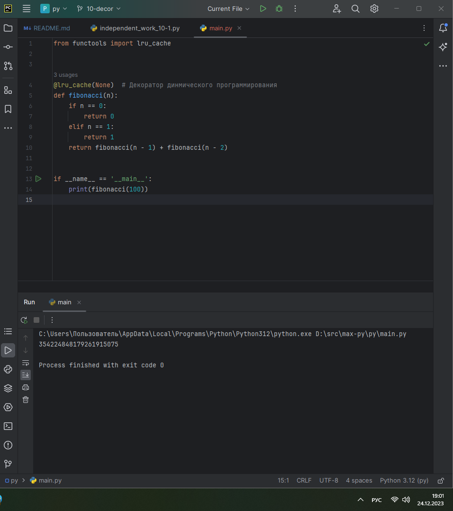
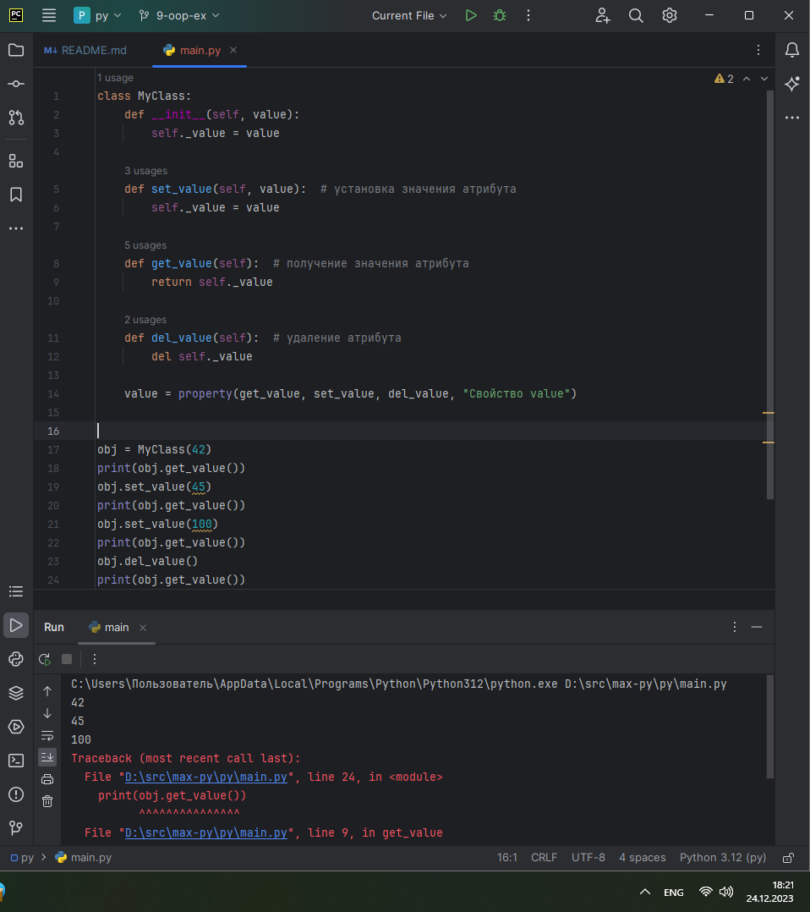
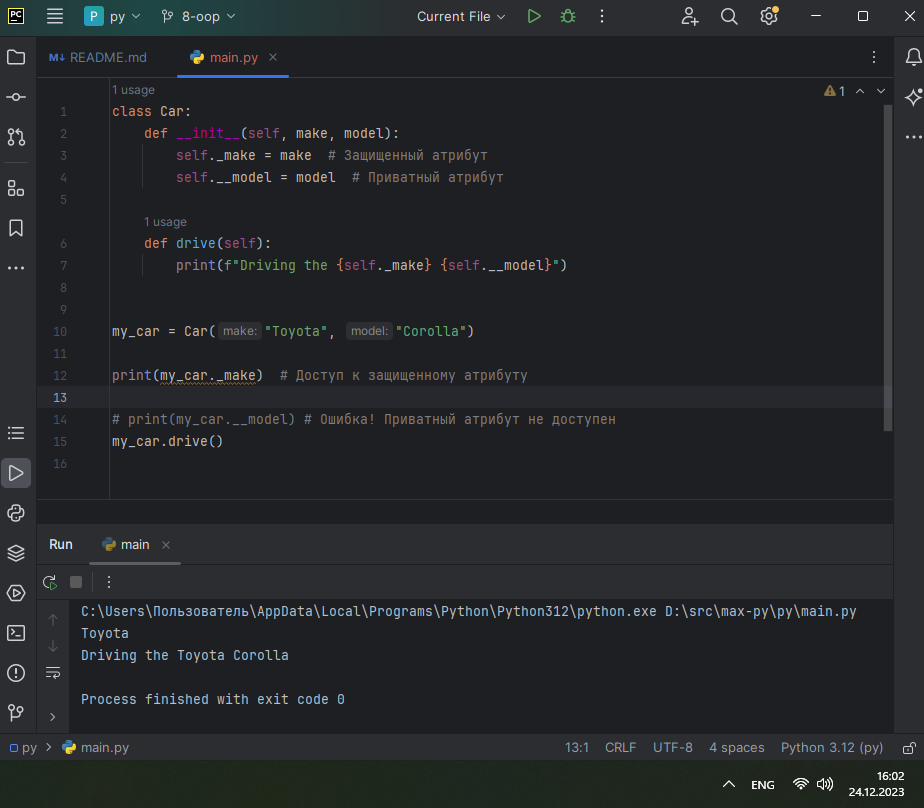
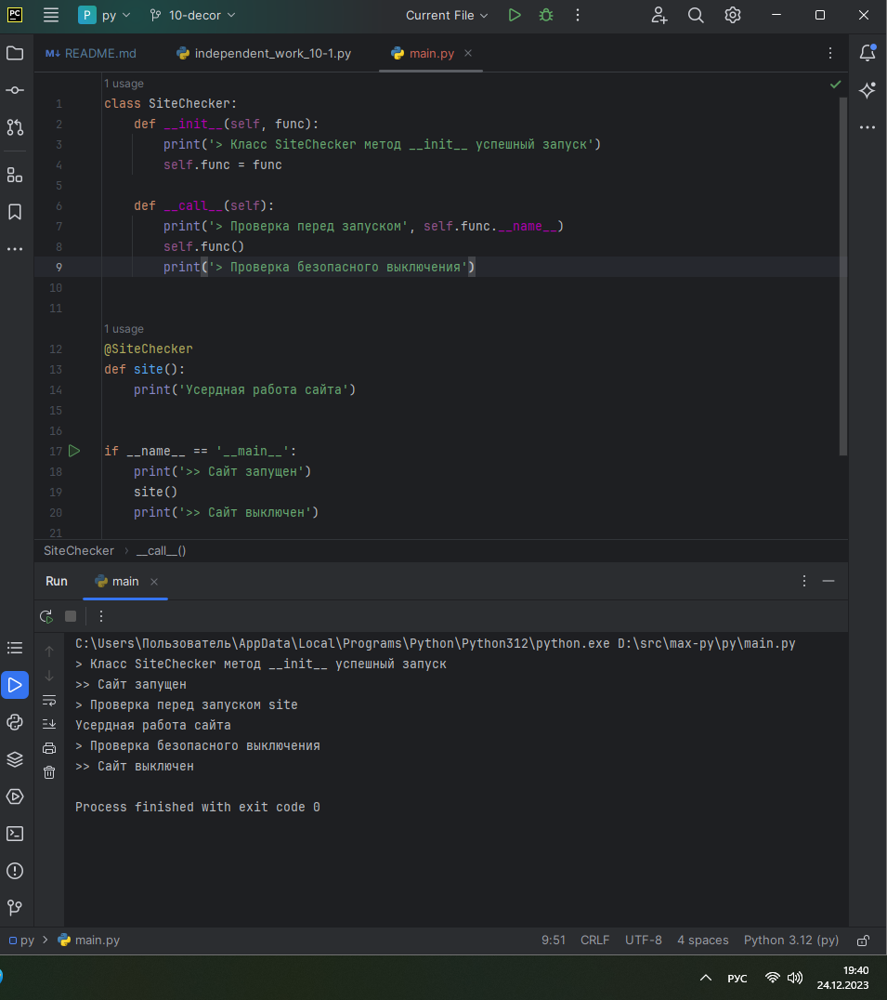
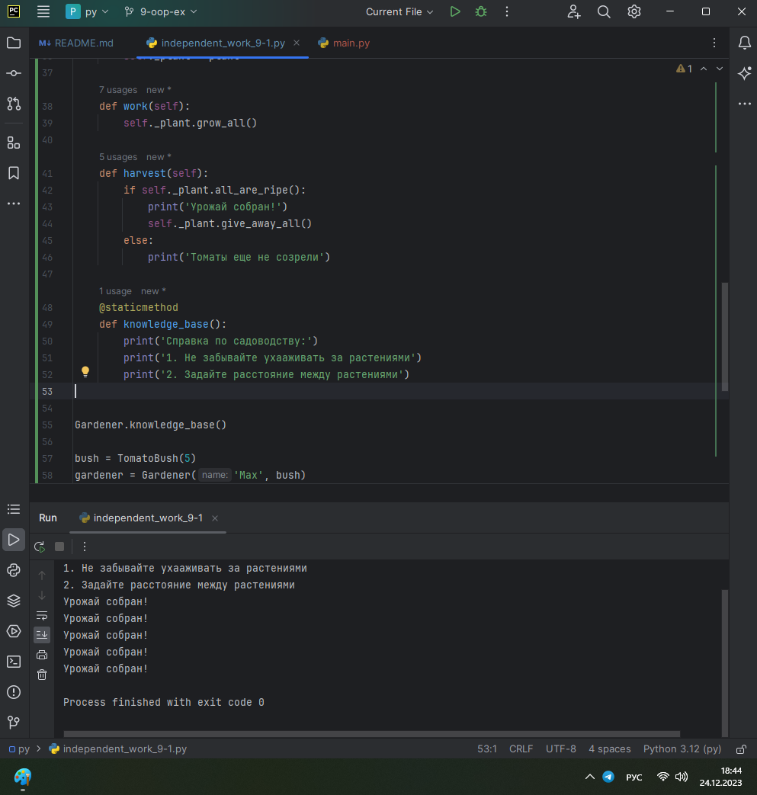

# ТЕМА 9. Концепции и принципы ООП

| Задание     | лаб. раб. | сам. раб. |
|-------------|-----------|-----------|
| Задание 1   | +         | +         |
| Задание 2   | +         |           |
| Задание 3   | +         |           |
| Задание 4   | +         |           |
| Задание 5   | +         |           |


Отчет по Теме #9 выполнил:
* Василько Максим Викторович
* ОЗИВТ-22-1-у

## Лабораторная работа №1
_Допустим, что вы решили оригинально и немного странно познакомится
с человеком. Для этого у вас должен быть написан свой класс на Python,
который будет проверять угадал ваше имя человек или нет. Для этого
создайте класс, указав в свойствах только имя. Дальше создайте
функцию __init__(), а в ней сделайте проверку на то угадал человек ваше
имя или нет. Также можете проверить что будет, если в этой функции
указав атрибут, который не указан в вашем классе, например,
попробуйте вызвать фамилию._




## Лабораторная работа №2
_Вам дали важное задание, написать продавцу мороженого программу,
которая будет писать добавили ли топпинг в мороженое и цену после
возможного изменения. Для этого вам нужно написать класс, в котором
будет определяться изменили ли состав мороженого или нет. В этом
классе реализуйте метод, выводящий на печать «Мороженое с
{ТОППИНГ}» в случае наличия добавки, а иначе отобразится
следующая фраза: «Обычное мороженое». При этом программа должна
воспринимать как топпинг только атрибуты типа string._


## Лабораторная работа №3
_Петя – начинающий программист и на занятиях ему сказали реализовать
икапсу…что-то. А вы хороший друг Пети и ко всему прочему прекрасно
знаете, что икапсу…что-то – это инкапсуляция, поэтому решаете помочь
вашему другу с написанием класса с инкапсуляцией. Ваш класс будет не
просто инкапсуляцией, а классом с сеттером, геттером и деструктором.
После написания класса вам необходимо продемонстрировать что все
написанные вами функции работают.
Также вас необходимо объяснить Пете почему на скриншоте ниже в
консоли выводится ошибка._



## Лабораторная работа №4
_Вам прекрасно известно, что кошки и собаки являются
млекопитающими, но компьютер этого не понимает, поэтому вам нужно
написать три класса: Кошки, Собаки, Млекопитающие. И при помощи
“наследования” объяснить компьютеру что кошки и собаки – это
млекопитающие. Также добавьте какой-нибудь свой атрибут для кошек
и собак, чтобы показать, что они чем-то отличаются друг от друга._




## Лабораторная работа №5
_На разных языках здороваются по-разному, но суть остается
одинаковой, люди друг с другом здороваются. Давайте вместе с вами
реализуем программу с полиморфизмом, которая будет описывать всю
суть первого предложения задачи. Для этого мы можем выбрать два
языка, например, русский и английский и написать для них отдельные
классы, в которых будет в виде атрибута слово, которым здороваются на
этих языках. А также напишем функцию, которая будет выводить
информацию о том, как на этих языках здороваются.
Заметьте, что для решения поставленной задачи мы использовали
декоратор @staticmethod, поскольку нам не нужны обязательные
параметры-ссылки вроде self._





## Самостоятельная работа №1

```
class Tomato:
    states = {'None': 0, 'Yellow': 1, 'Green': 2, 'Red': 3}

    def __init__(self, index):
        self._index = index
        self._state = self.states['None']

    def grow(self):
        if self._state < 3:
            self._state += 1

    def is_ripe(self):
        return True if self._state == 3 else False


class TomatoBush:

    def __init__(self, num):
        self.tomatoes = [Tomato(index) for index in range(1, num + 1)]

    def grow_all(self):
        for tomato in self.tomatoes:
            tomato.grow()

    def all_are_ripe(self):
        return all([tomato.is_ripe() for tomato in self.tomatoes])

    def give_away_all(self):
        self.tomatoes = []


class Gardener:

    def __init__(self, name, plant):
        self.name = name
        self._plant = plant

    def work(self):
        self._plant.grow_all()

    def harvest(self):
        if self._plant.all_are_ripe():
            print('Урожай собран!')
            self._plant.give_away_all()
        else:
            print('Томаты еще не созрели')

    @staticmethod
    def knowledge_base():
        print('Справка по садоводству:')
        print('1. Не забывайте ухааживать за растениями')
        print('2. Задайте расстояние между растениями')


Gardener.knowledge_base()

bush = TomatoBush(5)
gardener = Gardener('Max', bush)

gardener.work()
gardener.work()
gardener.work()

gardener.harvest()

gardener.work()
gardener.harvest()
gardener.work()
gardener.harvest()
gardener.work()
gardener.harvest()

gardener.work()
gardener.harvest()
```


### _Результат:_


### _Выводы:_
_В данном коде созданы классы Tomato, TomatoBush, Gardener и реализованы методы grow, is_ripe, grow_all, all_are_ripe, give_away_all, work, harvest knowledge_base согласно заданию_


