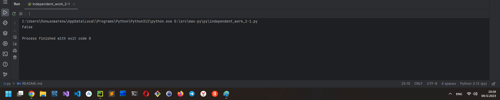
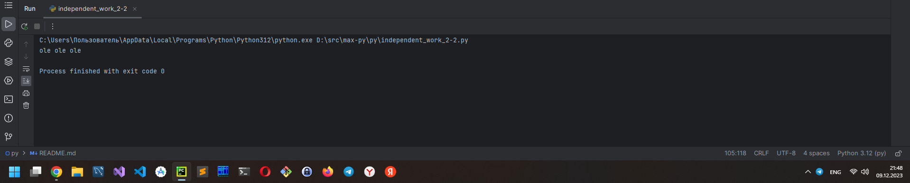
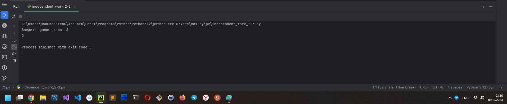
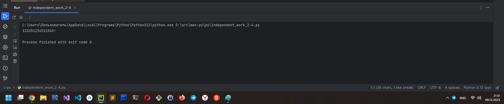
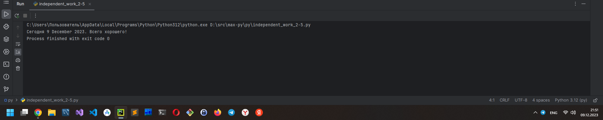
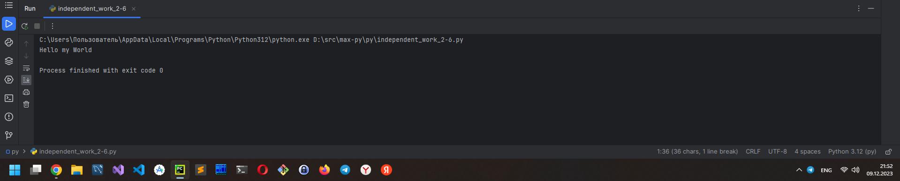
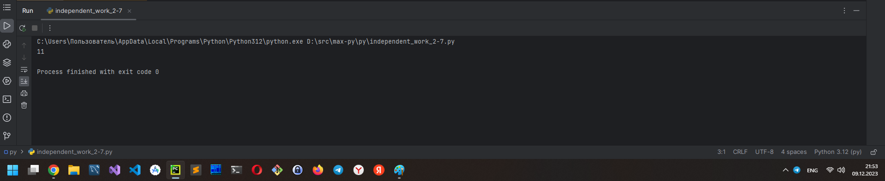
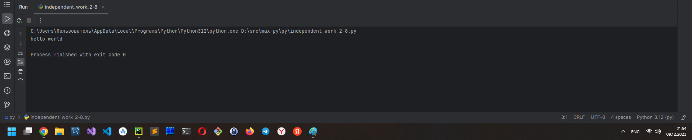
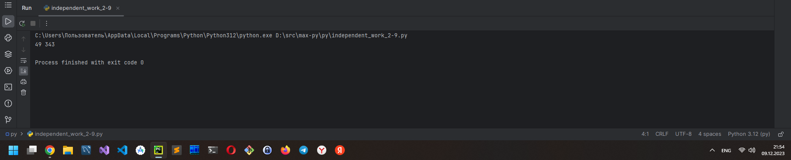
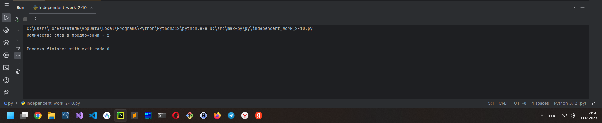

# ТЕМА 2. БАЗОВЫЕ ОПЕРАЦИИ ЯЗЫКА PYTHON

| Задание     | лаб. раб. | сам. раб.  |
|-------------|-----------|------------|
| Задание 1   | +         | +          |
| Задание 2   | +         | +          |
| Задание 3   | +         | +          |
| Задание 4   | +         | +          |
| Задание 5   | +         | +          |
| Задание 6   | +         | +          |
| Задание 7   | +         | +          |
| Задание 8   | +         | +          |
| Задание 9   | +         | +          |
| Задание 10  | +         | +          |

Отчет по Теме #2 выполнил:
* Василько Максим Викторович


## Самостоятельная работа №1
_Выведите в консоль булевую переменную False, не используя слово False в строке или изначально присвоенную булевую переменную. Программа должна занимать не более двух строк редактора кода_
```
lie = 2 * 2 == 5
print(lie)
```

### _Результат_


### _Выводы_
_В данном коде выводится логисеское значение **False** (ложь), т.к. выражение "дважды два равно четыре" ложно_


## Самостоятельная работа №2
_Присвоить значения трем переменным и вывести их в консоль, используя только две строки редактора кода_
```
a = b = c = "ole"
print(a, b, c)
```

### _Результат_


### _Выводы_
_В данном коде в первой строке инициализируются сразу три переменные одним и тем же значением (этим обеспечивается решение не более чем в две строки), а во второй строке выводятся их значения._

## Самостоятельная работа №3
_Реализуйте ввод данных в программу, через консоль, в виде только целых чисел (тип данных int). То есть при вводе буквенных символов в консоль, программа не должна работать. Программа должна занимать не более двух строк редактора кода._
```
val = int(input("Введите целое число: "))
print(val)
```

### _Результат_


### _Выводы_
_В данном коде ввод только целых чисел обеспечивается явным указанием типа int_

## Самостоятельная работа №4
_Создайте только одну строковую переменную. Длина строки должна не превышать 5 символов. На выходе мы должны получить строку длиной не менее 16 символов. Программа должна занимать не более двух строк редактора кода._
```
ss = "12345"
print(f"{ss}{ss}{ss}!")
```

### _Результат_


### _Выводы_
_В данном коде для команы print используется форматирование, а троекратный вывод значения одной переменной длиной 5 символов с завершающим восклицательным знаком, суммарно обеспечивает вывод строки в 16 символов._

## Самостоятельная работа №5
_Создайте три переменные: день (тип данных - числовой), месяц (тип данных - строка), год (тип данных - числовой) и выведите в консоль текущую дату в формате: “Сегодня день месяц год. Всего хорошего!” используя F строку и оператор end внутри print(), в котором вы должны написать фразу “Всего хорошего!”. Программа должна занимать не более двух строк редактора кода._
```
import datetime
d, m, y = list([datetime.datetime.now().day, datetime.datetime.now().strftime("%B"), datetime.datetime.now().year])
print(f"Сегодня {d} {m} {y}. ", end="Всего хорошего!")
```

### _Результат_


### _Выводы_
_В данной программе по заданию нужно обеспечить решение в три строки, этого мне удалось достичь только если не подключать модуль работы с датой, но в этом случае дата будет статичной. В данном случае преведено решение в три строки с выводом текущей даты. Значение переменных для хранения дня, месяца и года инициализируется через список._

## Самостоятельная работа №6
_В предложении ‘Hello World’ вставьте ‘my’ между двумя словами. Выведите полученное предложение в консоль в одну строку. Программа должна занимать не более двух строк редактора кода_
```
print("Hello", "World", sep=" my ")
```

### _Результат_


### _Выводы_
_В данном коде вствака между словами обеспечивается определением сепаратора при использовании команды print_

## Самостоятельная работа №7
_Узнайте длину предложения ‘Hello World’, результат выведите в консоль. Программа должна занимать не более двух строк редактора кода_
```
s = "Hello World"
print(len(s))
```

### _Результат_


### _Выводы_
_В данном коде подсчет длины строки реализуется посредсвом команды len_

## Самостоятельная работа №8
_Переведите предложение ‘HELLO WORLD’ в нижний регистр. Программа должна занимать не более двух строк редактора кода._
```
s = "HELLO WORLD"
print(s.lower())
```

### _Результат_


### _Выводы_
_В данном коде преобразование строки к нижнему регистру реализуется методом lower_

## Самостоятельная работа №9
_Вывести на экран значение квадрата и куба числовой переменной i_
```
i = 7
print(pow(i, 2), pow(i, 3))
```

### _Результат_


### _Выводы_
_В данном коде для возведения числа в степень используется команда pow, в которую первым аргументом передается исходное число, а вторым - степень, в которую необходимо возвести это число_

## Самостоятельная работа №10
_Вывести на экран количество слов в предложении "Hello World"_
```
s = "Hello World"
i = len(s.split())
print(f"Количество слов в предложении - {i}")
```

### _Результат_


### _Выводы_
_В данном коде подсчет слов реализуется путем команды split, которая возвращает список слов, а команда len выводит длину этого списка_