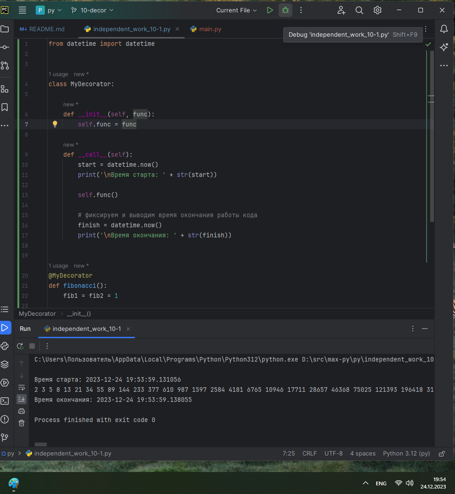
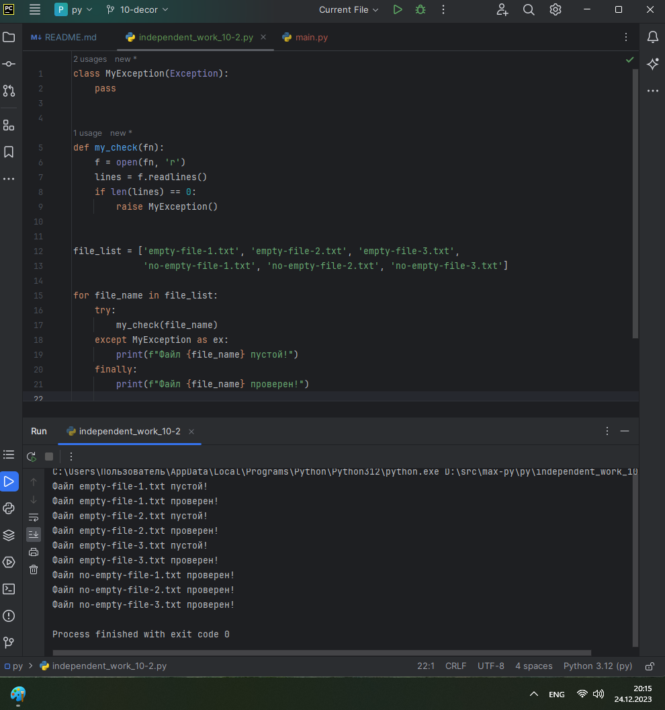
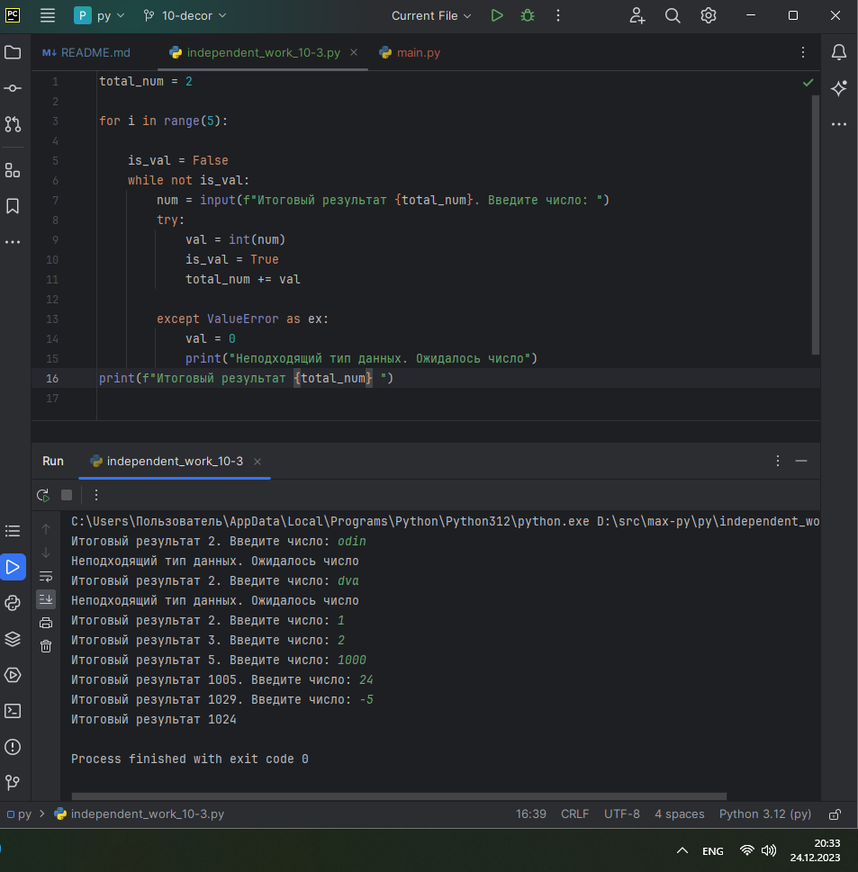
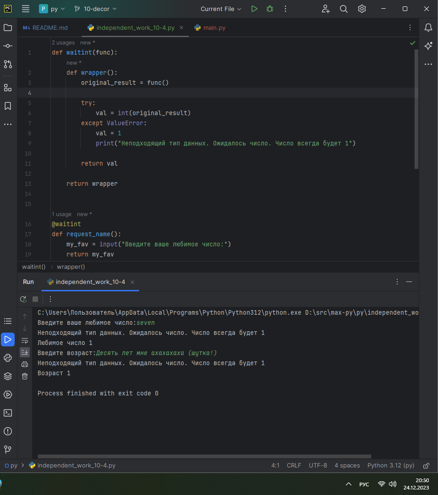
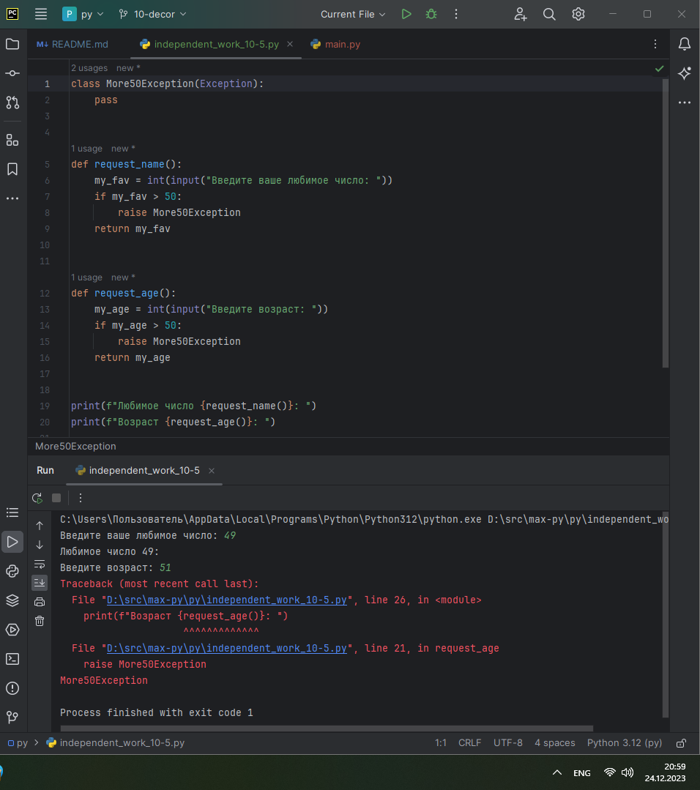

# ТЕМА 10. Декораторы и исключения

| Задание     | лаб. раб. | сам. раб. |
|-------------|-----------|-----------|
| Задание 1   | +         | +         |
| Задание 2   | +         | +         |
| Задание 3   | +         | +         |
| Задание 4   | +         | +         |
| Задание 5   | +         | +         |


Отчет по Теме #10 выполнил:
* Василько Максим Викторович
* ОЗИВТ-22-1-у

## Лабораторная работа №1
_Наверняка вы думаете, что декораторы – это какая-то бесполезная
вещь, которая вам никогда не пригодится, но тут вдруг на паре по
математике преподаватель просит всех посчитать число Фибоначчи для 100. Кто-то будет считать вручную (так точно не нужно), кто-то
посчитает на калькуляторе, а кто-то подумает, что он самый крутой и
напишет рекурсивную программу на Python и немного огорчится,
потому что данная программа будет достаточно долго считаться, если
ее просто так запускать. Но именно тут к вам на помощь приходят
декораторы, например @lru_cache (он предназначен для решения задач
динамическим программированием, если простыми словами, то этот
декоратор запоминает промежуточные результаты и при рекурсивном
вызове функции программа не будет считать одни и те же значения, а
просто “возьмёт их из этого декоратора”). Вам нужно написать
программу, которая будет считать числа Фибоначчи для 100 и
запустить ее без этого декоратора и с ним, посмотреть на разницу во
времени решения поставленной задачи.
P.S. при запуске без декоратора можете долго не ждать, для
наглядности хватит 10 секунд ожидания._


## Лабораторная работа №2
_Илья пишет свой сайт и ему необходимо сделать минимальную
проверку ввода данных пользователя при регистрации. Для этого он
реализовал функцию, которая выводит данные пользователя на экран и
решил, что будет проверять правильность введённых данных при
помощи декоратора, но в этом ему потребовалась ваша помощь.
Напишите декоратор для функции, который будет принимать все
параметры вызываемой функции (имя, возраст) и проверять чтобы
возраст был больше 0 и меньше 130.
Причем заметьте, что неважно сколько пользователь введет данных на
сайт к Илье, будут обрабатываться только первые 2 аргумента_


## Лабораторная работа №3
_Вам понравилась идея Ильи с сайтом, и вы решили дальше работать
вместе с ним. Но вот в вашем проекте появилась проблема, кто-то
пытается сломать вашу функцию с получением данных для сайта. Эта
функция работает только с данными integer, а какой-то недохакер
пытается все сломать и вместо нужного типа данных отправляет string.
Воспользуйтесь исключениями, чтобы неподходящий тип данных не
ломал ваш сайт.
Также дополнительно можете обернуть весь код функции в
try/except/finally для того, чтобы программа вас оповестила о том, что
выявлена какая-то ошибка или программа успешно выполнена._


## Лабораторная работа №4
_Продолжая работу над сайтом, вы решили написать собственное
исключение, которое будет вызываться в случае, если в функцию
проверки имени при регистрации передана строка длиннее десяти
символов, а если имя имеет допустимую длину, то в консоль
выводиться “Успешная регистрация”_


## Лабораторная работа №5
_После запуска сайта вы поняли, что вам необходимо добавить логгер,
для отслеживания его работы. Готовыми вариантами вы не захотели
пользоваться, и поэтому решили создать очень простую пародию. Для
этого создали две функции: __init__() (вызывается при создании класса
декоратора в программе) и __call__() (вызывается при вызове
декоратора). Создайте необходимый вам декоратор. Выведите все логи
в консоль._

 


## Самостоятельная работа №1
_Вовочка решил заняться спортивным программированием на python, но
для этого он должен знать за какое время выполняется его программа.
Он решил, что для этого ему идеально подойдет декоратор для
функции, который будет выяснять за какое время выполняется та или
иная функция. Помогите Вовочке в его начинаниях и напишите такой
декоратор.
Подсказка: необходимо использовать модуль time
Декоратор необходимо использовать для функции.
Результатом вашей работы будет листинг кода и скриншот консоли, в
котором будет выполненная функция Фибоначчи и время выполнения
программы.
Также на этом примере можете посмотреть, что решение задач через
рекурсию не всегда является хорошей идеей. Поскольку решение
Фибоначчи для 100 с использованием рекурсии и без динамического
программирования решается более десяти секунд, а решение точно
такой же задачи, но через цикл for еще и для 200, занимает меньше 1
секунды._

```
from datetime import datetime


class MyDecorator:

    def __init__(self, func):
        self.func = func

    def __call__(self):
        start = datetime.now()
        print('\nВремя старта: ' + str(start))

        self.func()

        # фиксируем и выводим время окончания работы кода
        finish = datetime.now()
        print('\nВремя окончания: ' + str(finish))


@MyDecorator
def fibonacci():
    fib1 = fib2 = 1

    for i in range(2, 200):
        fib1, fib2 = fib2, fib1 + fib2
        print(fib2, end=' ')


if __name__ == '__main__':
    fibonacci()
```


### _Результат:_


### _Выводы:_
_В данном коде реализован декоратор для вызова функции, в котором выводится сообщение о времени работы функции._


## Самостоятельная работа №2
_Посмотрев на Вовочку, вы также загорелись идеей спортивного
программирования, начав тренировки вы узнали, что для решения
некоторых задач необходимо считывать данные из файлов. Но через
некоторое время вы столкнулись с проблемой что файлы бывают
пустыми, и вы не получаете вводные данные для решения задачи.
После этого вы решили не просто считывать данные из файла, а всю
конструкцию оборачивать в исключения, чтобы избежать такой
проблемы. Создайте пустой файл и файл, в котором есть какая-то
информация. Напишите код программы. Если файл пустой, то, нужно
вызвать исключение (“бросить исключение”) и вывести в консоль
“файл пустой”, а если он не пустой, то вывести информацию из файла._

```
class MyException(Exception):
    pass


def my_check(fn):
    f = open(fn, 'r')
    lines = f.readlines()
    if len(lines) == 0:
        raise MyException()


file_list = ['empty-file-1.txt', 'empty-file-2.txt', 'empty-file-3.txt',
             'no-empty-file-1.txt', 'no-empty-file-2.txt', 'no-empty-file-3.txt']

for file_name in file_list:
    try:
        my_check(file_name)
    except MyException as ex:
        print(f"Файл {file_name} пустой!")
    finally:
        print(f"Файл {file_name} проверен!")
```

### _Результат:_


### _Выводы:_
_В данном коде на вход передается массив из 6 файлов, три из которых пустые. Функция my_check проверяет файл на наличиче в нем хоть какой-либо информации, и в случае если файл пустой - программа бросает исключение MyException_

## Самостоятельная работа №3
_Напишите функцию, которая будет складывать 2 и введенное
пользователем число, но если пользователь введет строку или другой
неподходящий тип данных, то в консоль выведется ошибка
“Неподходящий тип данных. Ожидалось число.”. Реализовать
функционал программы необходимо через try/except и подобрать
правильный тип исключения. Создавать собственное исключение
нельзя. Проведите несколько тестов, в которых исключение вызывается
и нет. Результатом выполнения задачи будет листинг кода и
получившийся вывод в консоль_

```
total_num = 2

for i in range(5):

    is_val = False
    while not is_val:
        num = input(f"Итоговый результат {total_num}. Введите число: ")
        try:
            val = int(num)
            is_val = True
            total_num += val

        except ValueError as ex:
            val = 0
            print("Неподходящий тип данных. Ожидалось число")
print(f"Итоговый результат {total_num} ")
```

### _Результат:_


### _Выводы:_
_В данном коде реализован последовательный ввод значения с клавиатуры, и в случае если было введено не число, в момент приведения типов срабатывает исключение которое мы перехватываем и сообщаем об ошибке, после чего запрашиваем повторный ввод. Таким образом в консоль последовательо выводится сумма чисел._

## Самостоятельная работа №4
_Создайте собственный декоратор, который будет использоваться для
двух любых вами придуманных функций. Декораторы, которые
использовались ранее в работе нельзя воссоздавать. Результатом
выполнения задачи будет: класс декоратора, две как-то связанными с
ним функциями, скриншот консоли с выполненной программой и
подробные комментарии, которые будут описывать работу вашего
кода._

```
def waitint(func):
    def wrapper():
        original_result = func()

        try:
            val = int(original_result)
        except ValueError:
            val = 1
            print("Неподходящий тип данных. Ожидалось число. Число всегда будет 1")

        return val

    return wrapper


@waitint
def request_name():
    my_fav = input("Введите ваше любимое число:")
    return my_fav


@waitint
def request_age():
    my_age = input("Введите возраст:")
    return my_age


print(f"Любимое число {request_name()}")
print(f"Возраст {request_age()}")
```

### _Результат:_


### _Выводы:_
_В данном коде декоратор реализован функцией. и в то м случае если введенное число не является валидным, то считается что число равно 1_

## Самостоятельная работа №5
_Создайте собственное исключение, которое будет использоваться в
двух любых фрагментах кода. Исключения, которые использовались
ранее в работе нельзя воссоздавать. Результатом выполнения задачи
будет: класс исключения, код к котором в двух местах используется это
исключение, скриншот консоли с выполненной программой и
подробные комментарии, которые будут описывать работу вашего
кода.

```
class More50Exception(Exception):
    pass


def request_name():
    my_fav = int(input("Введите ваше любимое число: "))
    if my_fav > 50:
        raise More50Exception
    return my_fav


def request_age():
    my_age = int(input("Введите возраст: "))
    if my_age > 50:
        raise More50Exception
    return my_age


print(f"Любимое число {request_name()}: ")
print(f"Возраст {request_age()}: ")
```

### _Результат:_


### _Выводы:_
_В данном коде реализовано собственное исключение, когда запрашиваемое число больше 50_
