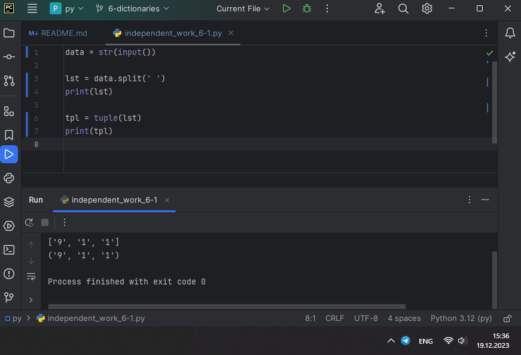
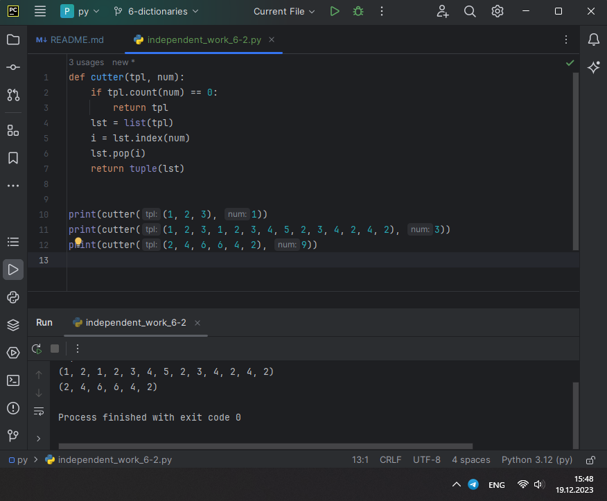
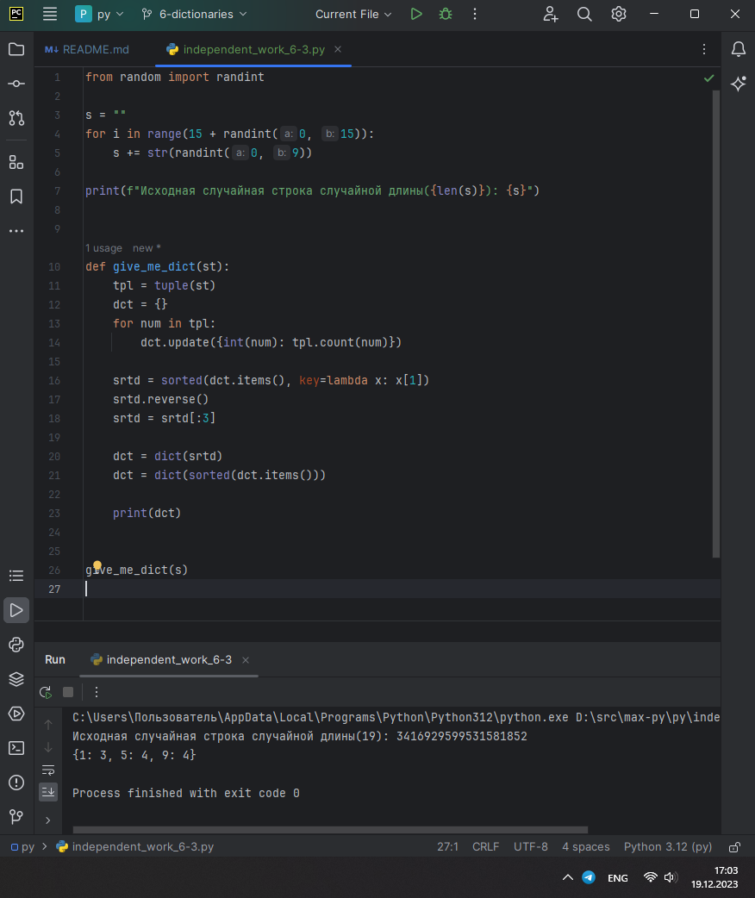
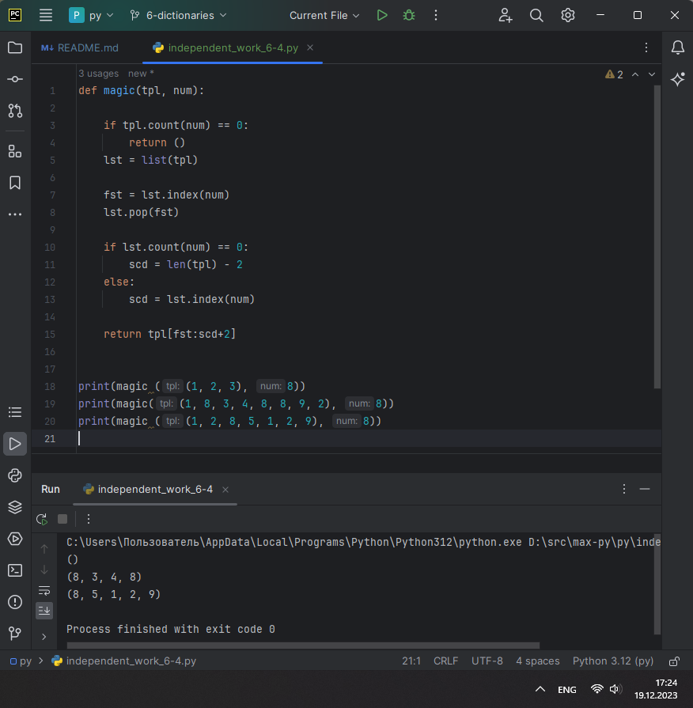

# ТЕМА 6. Базовые коллекции: словари, кортежи

| Задание     | лаб. раб. | сам. раб. |
|-------------|-----------|-----------|
| Задание 1   | +         | +         |
| Задание 2   | +         | +         |
| Задание 3   | +         | +         |
| Задание 4   | +         | +         |
| Задание 5   | +         | +         |


Отчет по Теме #6 выполнил:
* Василько Максим Викторович
* ОЗИВТ-22-1-у

## Лабораторная работа №1
_В школе, где вы учились, узнали, что вы крутой программист и
попросили написать программу для учителей, которая будет при вводе
кабинета писать для него ключ доступа и статус, занят кабинет или нет.
При написании программы необходимо использовать словарь (dict),
который на вход получает номер кабинета, а выводит необходимую
информацию. Если кабинета, который вы ввели нет в словаре, то в
консоль в виде значения ключа нужно вывести “None” и виде статуса
вывести “False”.
По большому счету написав данную программу мы с вами научились
заменять иногда громоздкую конструкцию if/elif/else. Поскольку здесь
функционал словаря полностью повторяет функционал условия, но при
этом у использования словарей в более сложных программах есть
намного больше возможностей реализации._


## Лабораторная работа №2
_Алексей решил создать самый большой словарь в мире. Для этого он
придумал функцию dict_maker (**kwargs), которая принимает
неограниченное количество параметров «ключ: значение» и обновляет
созданный им словарь my_dict, состоящий всего из одного элемента
«first» со значением «so easy». Помогите Алексею создать данную
функцию.
Ниже на скриншоте мы использовали встроенный модуль pprint,
который выводит большие объемы информации более понятно для
восприятия человеческим глазом. Иногда очень удобно использовать
данную возможность Python_


## Лабораторная работа №3
_Для решения некоторых задач бывает необходимо разложить строку на
отдельные символы. Мы знаем что это можно сделать при помощи
split(), у которого более гибкая настройка для разделения для этого, но
если нам нужно посимвольно разделить строку без всяких условий, то
для этого мы можем использовать кортежи (tuple). Для этого напишем
любую строку, которую будем делить и “обвернем” ее в tuple и дальше
мы можем как нам угодно с ней работать, например, сделать ее
списком (тогда получится полный аналог split()) или же работать с ним
дальше, как с кортежем._


## Лабораторная работа №4
_Вовочка решил написать крутую функцию, которая будет писать имя,
возраст и место работы, но при этом на вход этой функции будет
поступать кортеж. Помогите Вовочке написать эту программу._


## Лабораторная работа №5
_Для сопровождения первых лиц государства X нужен кортеж, но никто
не может определиться с порядком машин, поэтому вам нужно
написать функцию, которая будет сортировать кортеж, состоящий из
целых чисел по возрастанию, и возвращает его. Если хотя бы один
элемент не является целым числом, то функция возвращает исходный
кортеж._


 
## Самостоятельная работа №1
_При создании сайта у вас возникла потребность обрабатывать
данные пользователя в странной форме, а потом переводить их в
нужные вам форматы. Вы хотите принимать от пользователя
последовательность чисел, разделенных пробелом, а после
переформатировать эти данные в список и кортеж. Реализуйте вашу
задумку. Для получения начальных данных используйте input().
Результатом программы будет выведенный список и кортеж из
начальных данных._

```
data = str(input())

lst = data.split(' ')
print(lst)

tpl = tuple(lst)
print(tpl)
```


### _Результат:_


### _Выводы:_
_В данном коде из строки формируется список, а из списка кортеж, после чего список и кортеж последовательно выводятся в консоль._


## Самостоятельная работа №2
_Николай знает, что кортежи являются неизменяемыми, но он очень
упрямый и всегда хочет доказать, что он прав. Студент решил
создать функцию, которая будет удалять первое появление
определенного элемента из кортежа по значению и возвращать
кортеж без него. Попробуйте повторить шедевр не признающего
авторитеты начинающего программиста. Но учтите, что Николай не
всегда уверен в наличии элемента в кортеже (в этом случае кортеж
вернется функцией в исходном виде)._

_Входные данные:_

_(1, 2, 3), 1)_

_(1, 2, 3, 1, 2, 3, 4, 5, 2, 3, 4, 2, 4, 2), 3)_

_(2, 4, 6, 6, 4, 2), 9)_

_Ожидаемый результат:_

_(2, 3)_

_(1, 2, 1, 2, 3, 4, 5, 2, 3, 4, 2, 4, 2)_

_(2, 4, 6, 6, 4, 2)_

```
def cutter(tpl, num):
    if tpl.count(num) == 0:
        return tpl
    lst = list(tpl)
    i = lst.index(num)
    lst.pop(i)
    return tuple(lst)


print(cutter((1, 2, 3), 1))
print(cutter((1, 2, 3, 1, 2, 3, 4, 5, 2, 3, 4, 2, 4, 2), 3))
print(cutter((2, 4, 6, 6, 4, 2), 9))
```

### _Результат:_


### _Выводы:_
_В данном коде решает функция cutter - которая возвращает исходный кортеж в случае, если исключаемого значения итак нет в кортеже, а в ином случае кортеж преобразуется в список, из списка по первому вхождению определяется индекс и по индексу исключается требуемое число, после чего функция возвращает модифицированный список преобразованный в кортеж._

## Самостоятельная работа №3
_Ребята поспорили кто из них одним нажатием на numpad наберет
больше повторяющихся цифр, но не понимают, как узнать
победителя. Вам им нужно в этом помочь. Дана строка в виде
случайной последовательности чисел от 0 до 9 (длина строки
минимум 15 символов). Требуется создать словарь, который в
качестве ключей будет принимать данные числа (т. е. ключи будут
типом int), а в качестве значений – количество этих чисел в
имеющейся последовательности. Для построения словаря создайте
функцию, принимающую строку из цифр. Функция должна
возвратить словарь из 3-х самых часто встречаемых чисел, также
эти значения нужно вывести в порядке возрастания ключа._

```
from random import randint

s = ""
for i in range(15 + randint(0, 15)):
    s += str(randint(0, 9))

print(f"Исходная случайная строка случайной длины({len(s)}): {s}")


def give_me_dict(st):
    tpl = tuple(st)
    dct = {}
    for num in tpl:
        dct.update({int(num): tpl.count(num)})

    srtd = sorted(dct.items(), key=lambda x: x[1])
    srtd.reverse()
    srtd = srtd[:3]

    dct = dict(srtd)
    dct = dict(sorted(dct.items()))

    print(dct)


give_me_dict(s)
```

### _Результат:_


### _Выводы:_
_В данном коде генерируется строка случайной длины (15-30 цифр), которая далее передается в функцию, в которой из строки формируется кортеж для подсчета посредсовом count количества повторений цифры, и в том же проходе по строке формируется словарь, в котором ключ - целочисленное представление цифры, а значение - количество повторений, подсчитаное посредством кортежа. далее словарь сортируется по значению по убыванию(для получения самый часто встречающихся цифр), получается список, список сокращается до трех элементов, и затем уже этот список преобразуется в словарь который сортируется уже по ключу и его то и возвращает функция. так работает данный код, который выполняет поставленную задачу._

## Самостоятельная работа №4
_Ваш хороший друг владеет офисом со входом по электронным
картам, ему нужно чтобы вы написали программу, которая
показывала в каком порядке сотрудники входили и выходили из
офиса. Определение сотрудника происходит по id. Напишите
функцию, которая на вход принимает кортеж и случайный элемент
(id), его можно придумать самостоятельно. Требуется вернуть
новый кортеж, начинающийся с первого появления элемента в нем и
заканчивающийся вторым его появлением включительно.
Если элемента нет вовсе – вернуть пустой кортеж.
Если элемент встречается только один раз, то вернуть кортеж,
который начинается с него и идет до конца исходного._

_Входные данные:_

_(1, 2, 3), 8)_

_(1, 8, 3, 4, 8, 8, 9, 2), 8)_

_(1, 2, 8, 5, 1, 2, 9), 8)_

_Ожидаемый результат:_

_()_

_(8, 3, 4, 8)_

_(8, 5, 1, 2, 9)_

```
def magic(tpl, num):

    if tpl.count(num) == 0:
        return ()
    lst = list(tpl)

    fst = lst.index(num)
    lst.pop(fst)

    if lst.count(num) == 0:
        scd = len(tpl) - 2
    else:
        scd = lst.index(num)

    return tpl[fst:scd+2]


print(magic ((1, 2, 3), 8))
print(magic((1, 8, 3, 4, 8, 8, 9, 2), 8))
print(magic ((1, 2, 8, 5, 1, 2, 9), 8))
```

### _Результат:_


### _Выводы:_
_В данном коде функция magic принимает кортеж и искомое число, и далее выясняется если числа нет в кортеже - возвращается пустой кортеж, иначе засекается индекс первого и второго вхождений, используя преобразования кортежа к списку, и возвращается слайс кортежа с полученными ранее индексами, с учетом корректировки что первое вхожнеие было исключено из временного списка. так же, если второе вхождение отсуствует, то второй индекс принимается за длину кортежа с корректирующей 2кой._

## Самостоятельная работа №5
_Самостоятельно придумайте и решите задачу, в которой будут
обязательно использоваться кортеж или список. Проведите
минимум три теста для проверки работоспособности вашей задачи_.

_Создайте словарь длиной 5 из случайных чисел ключ:значение. Выведите словарь на экран._
```
from random import randint


def give_me_dict():
    dct = {}
    for i in range(5):
        dct.update({randint(1, 1000): randint(1, 1000)})
    return dct


print(give_me_dict())
print(give_me_dict())
print(give_me_dict())
```

### _Результат:_


### _Выводы:_
_В данном коде формирование словаря происходит в функции give_me_dict, в которой последовательно 5 раз словарь обновляется парой ключ:значение, где и ключ и значение является случайным числои от 1 до 1000_

