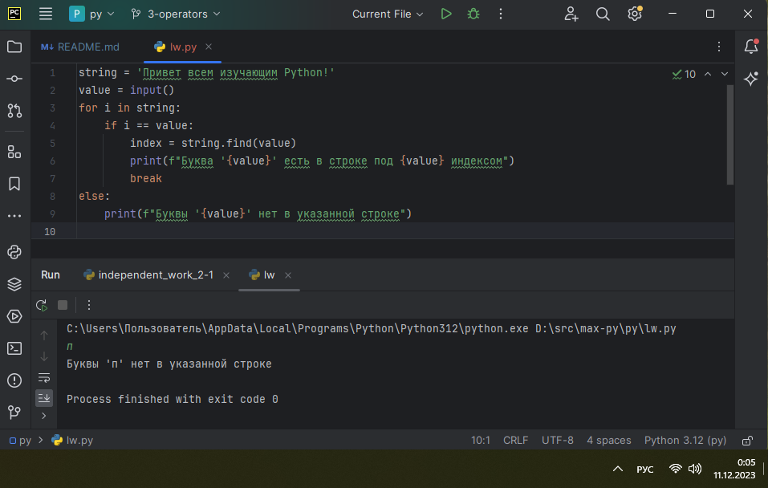
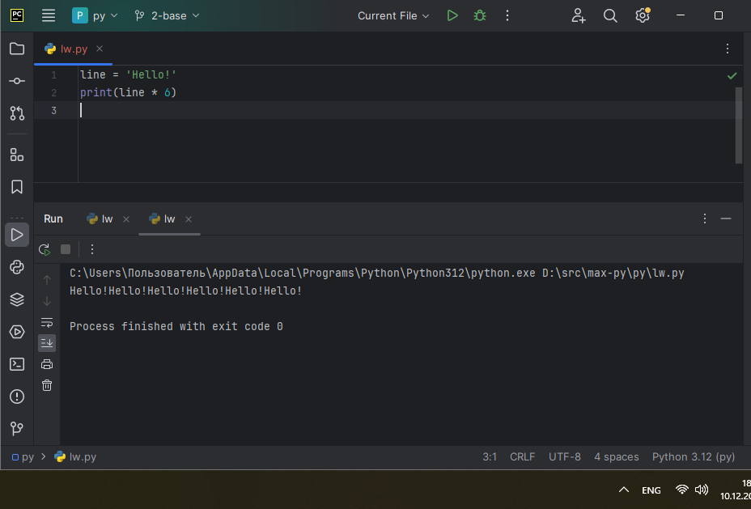
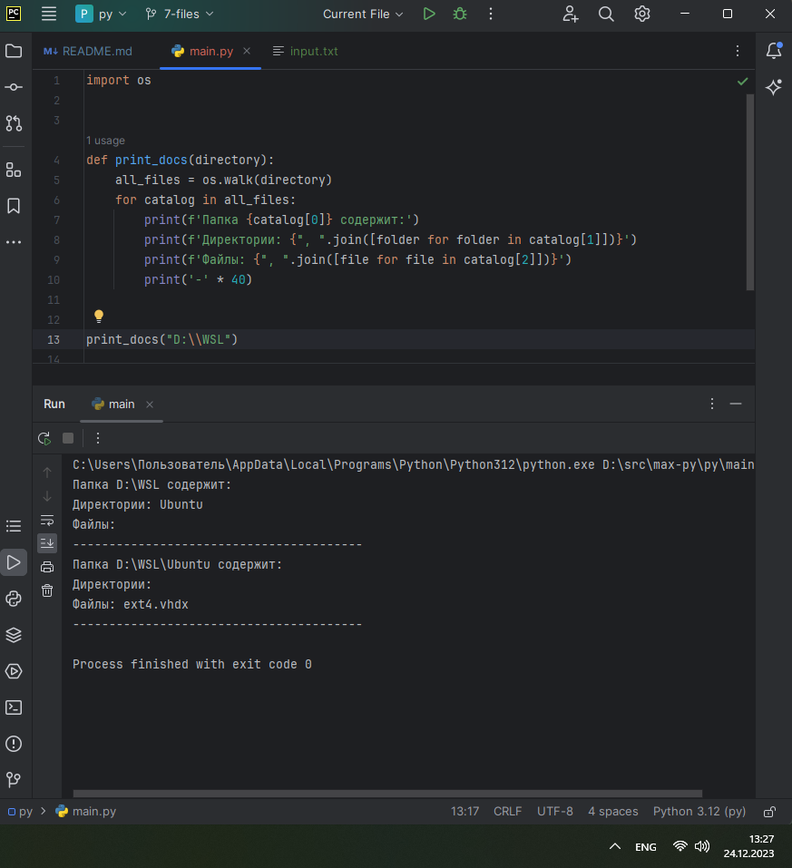
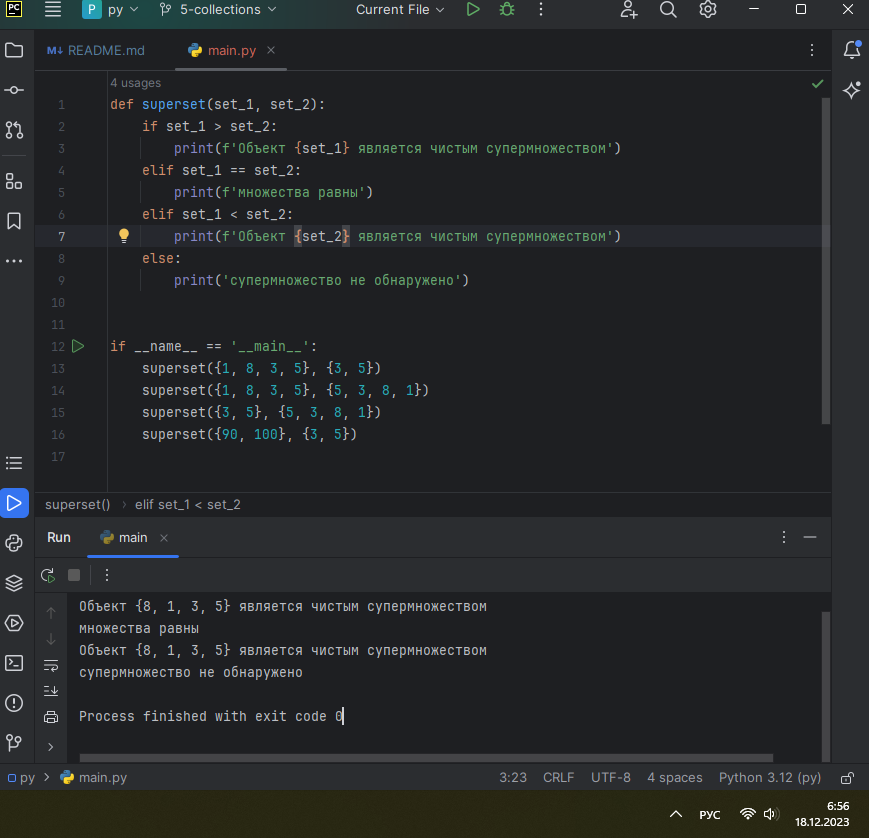
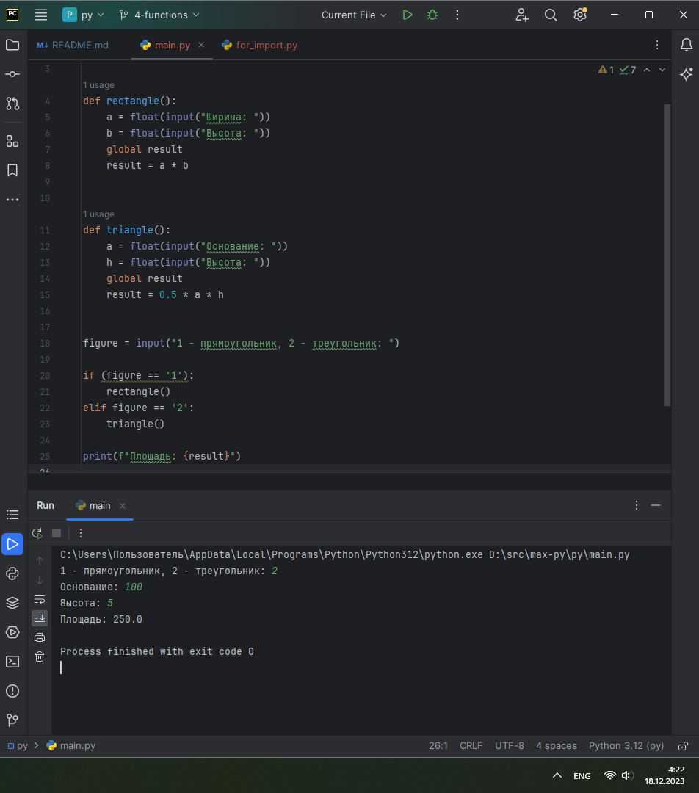
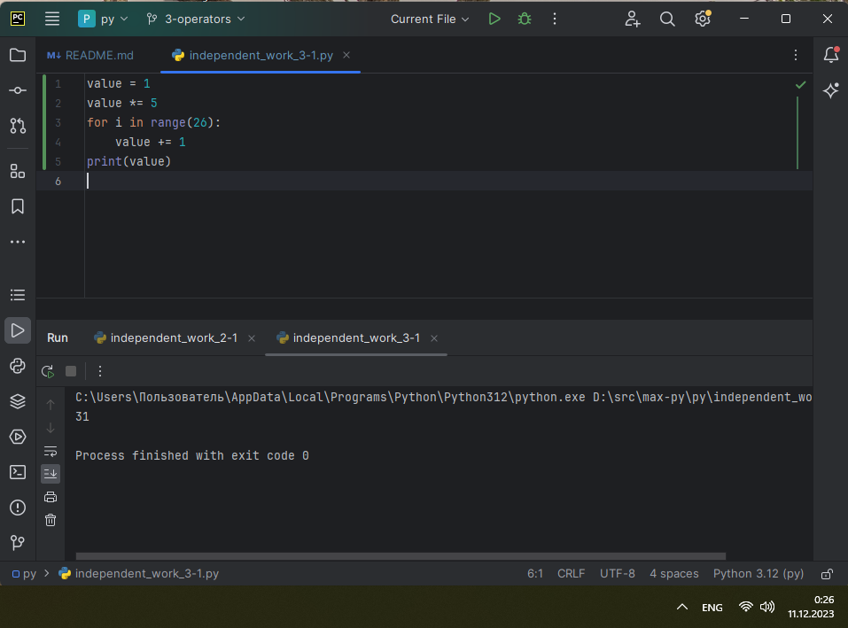
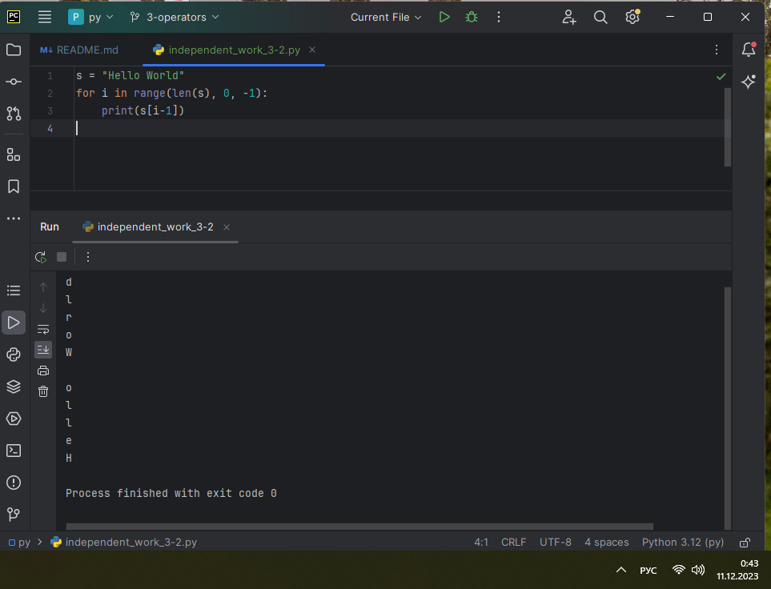
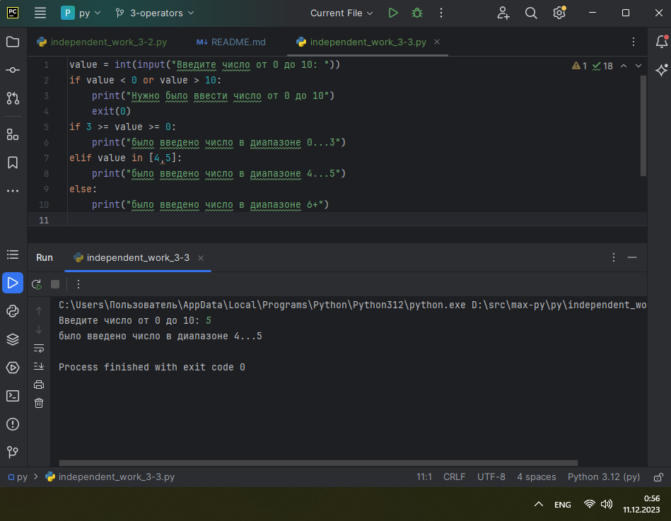
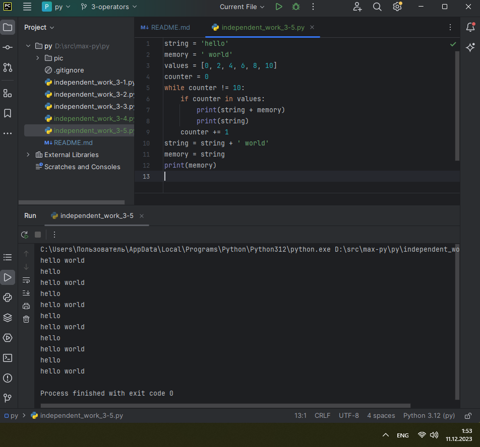

# ТЕМА 3. ОПЕРАТОРЫ, УСЛОВИЯ, ЦИКЛЫ

| Задание     | лаб. раб. | сам. раб. |
|-------------|-----------|-----------|
| Задание 1   | +         | -         |
| Задание 2   | +         | -         |
| Задание 3   | +         | -         |
| Задание 4   | +         | -         |
| Задание 5   | +         | -         |
| Задание 6   | +         | -         |
| Задание 7   | +         | -         |
| Задание 8   | +         | -         |
| Задание 9   | +         | -         |
| Задание 10  | +         | -         |

Отчет по Теме #3 выполнил:
* Василько Максим Викторович
* ОЗИВТ-22-1-у

## Лабораторная работа №1
_Создайте две переменные, значение которых будете вводить через консоль. Также составьте условие, в котором созданные ранее переменные будут сравниваться, если условие выполняется, то выведете в консоль «Выполняется», если нет, то «Не выполняется»._

## Лабораторная работа №2
_Напишите программу, которая будет определять значения переменной меньше 0, больше 0 и меньше 10 или больше 10. Это нужно реализовать при помощи одной переменной, значение которой будет вводится через консоль, а также при помощи конструкций if, elif, else._

## Лабораторная работа №3
_Напишите программу, в которой будет проверяться есть ли переменная в указанном массиве используя логический оператор in. Самостоятельно посмотрите, как работает программа со значениями которых нет в массиве numbers._

## Лабораторная работа №4
_Напишите программу, которая будет определять находится ли переменная в указанном массиве и если да, то проверьте четная она или нет. Самостоятельно протестируйте данную программу с разными значениями переменной value_

## Лабораторная работа №5
_Напишите программу, которая будет определять находится ли переменная в указанном массиве и если да, то проверьте четная она или нет. Самостоятельно протестируйте данную программу с разными значениями переменной value_

## Лабораторная работа №6
_Напишите программу, в которой при помощи цикла for определяется есть ли переменная value в строке string и посмотрите, как работает оператор else для циклов. Самостоятельно посмотрите, что выведет программа, если значение переменной value оказалось в строке string._

_Определять индекс буквы не обязательно, но если вы хотите, то это делается при помощи строки: index = string.find(value) Вы берете название переменной, в которой вы хотите что-то найти, затем применяете встроенный метод find() и в нем указываете то, что вам нужно найти. Данная строка вернет индекс искомого объекта_

## Лабораторная работа №7
_Напишите программу, в которой вы наглядно посмотрите, как работает цикл for проходя в обратном порядке, то есть, к примеру не от 0 до 10, а от 10 до 0. В уже готовой программе показано вычитание из 100, а вам во время реализации программы будет необходимо придумать свой вариант применения обратного цикла._

## Лабораторная работа №8
_Напишите программу используя цикл while, внутри которого есть какие-либо проверки, но быть осторожным, поскольку циклы while при Михаил А. Панов неправильно написанных условиях могут становится бесконечными._

## Лабораторная работа №9
_Напишите программу с использованием вложенных циклов и одной проверкой внутри них. Самое главное, не забудьте, что нельзя использовать одинаковые имена итерируемых переменных, когда вы используете вложенные циклы_

## Лабораторная работа №10
_Напишите программу с использованием flag, которое будет определять есть ли нечетное число в массиве. В данной задаче flag выступает в роли индикатора встречи нечетного числа в исходном массиве, четных чисел._

## Самостоятельная работа №1

### _Результат:_

### _Выводы:_

## Самостоятельная работа №2

### _Результат:_

### _Выводы:_

## Самостоятельная работа №3

### _Результат:_

### _Выводы:_

## Самостоятельная работа №4

### _Результат:_

### _Выводы:_

## Самостоятельная работа №5

### _Результат:_

### _Выводы:_

## Самостоятельная работа №6

### _Результат:_

### _Выводы:_

## Самостоятельная работа №7

### _Результат:_

### _Выводы:_

## Самостоятельная работа №8

### _Результат:_

### _Выводы:_

## Самостоятельная работа №9

### _Результат:_

### _Выводы:_

## Самостоятельная работа №10

### _Результат:_

### _Выводы:_
