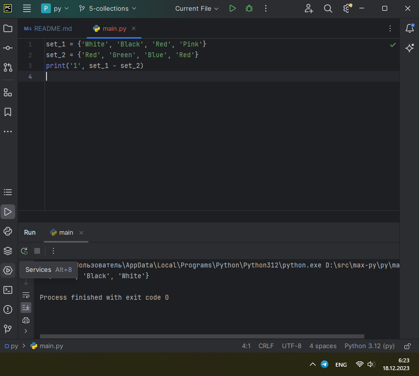
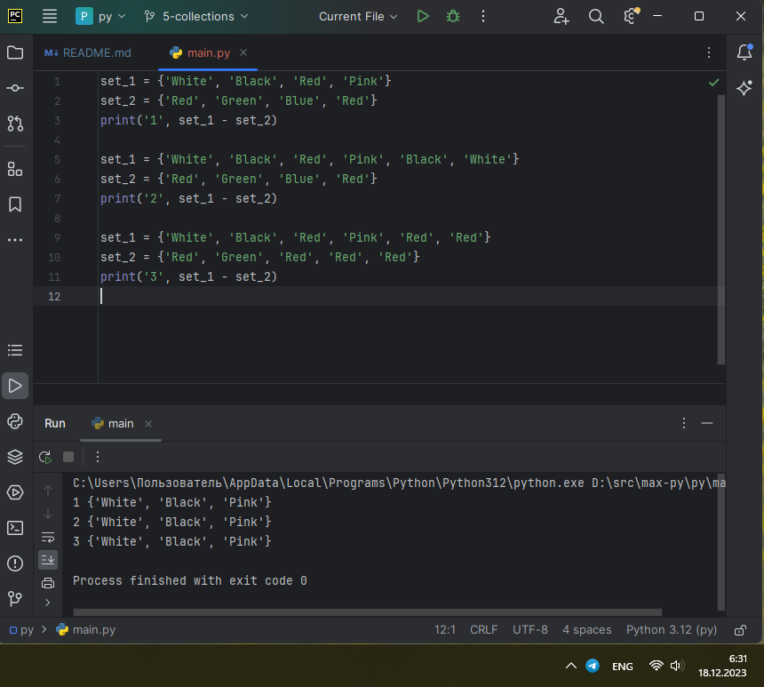
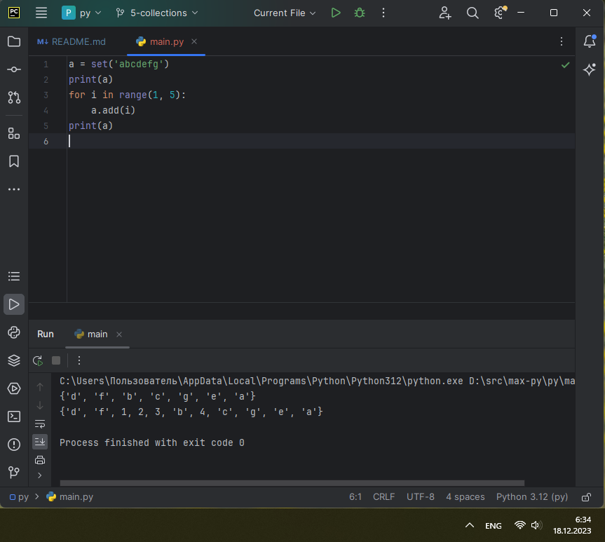
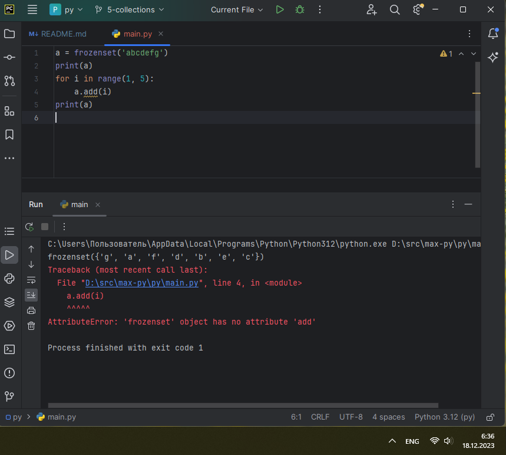
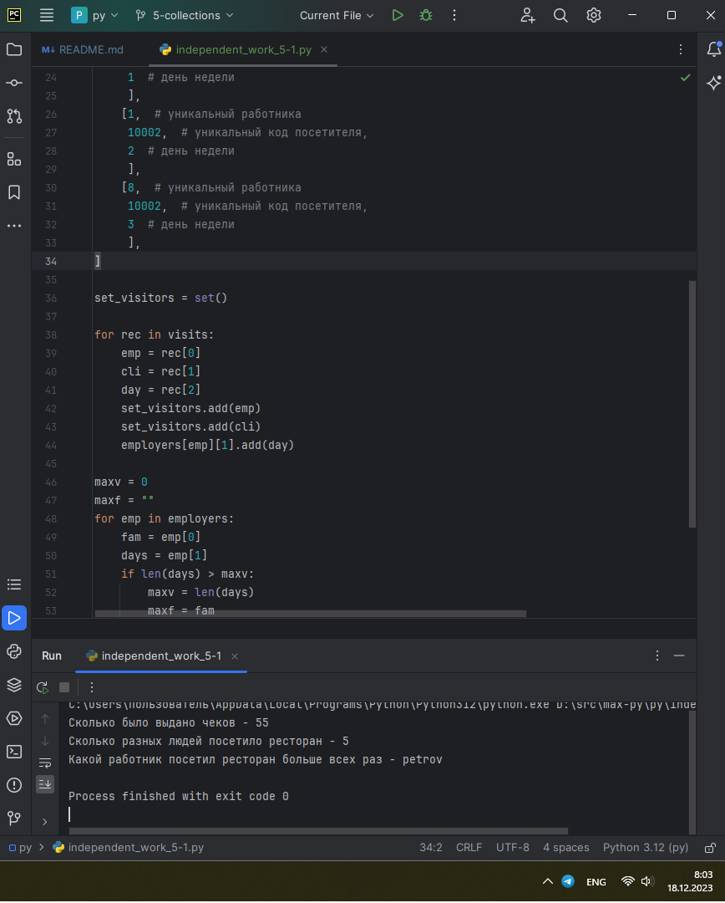
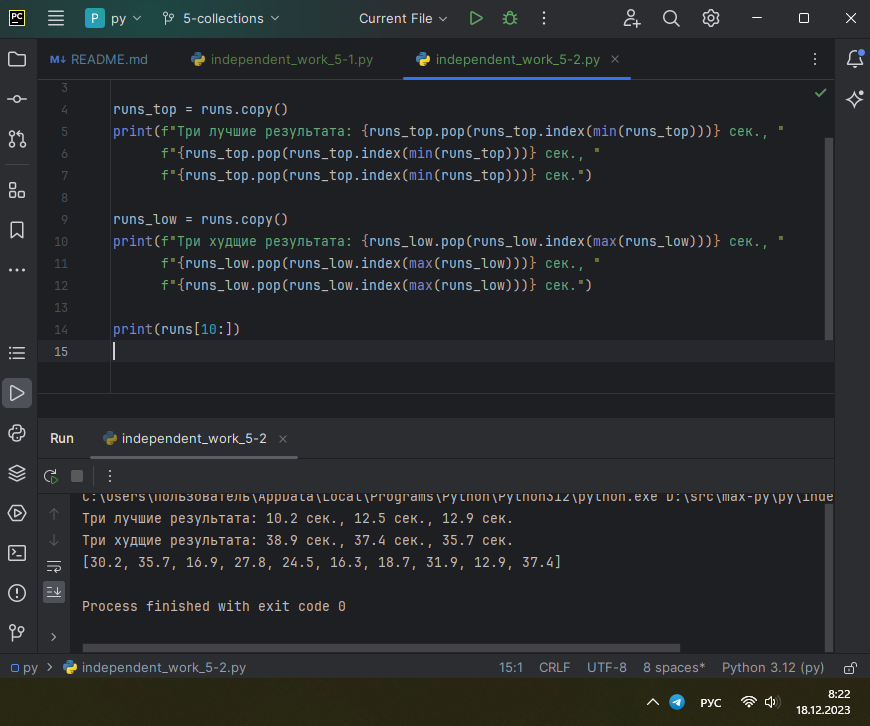
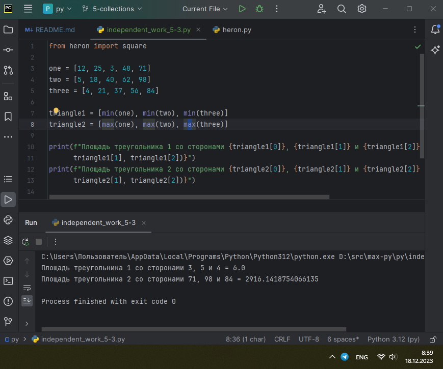
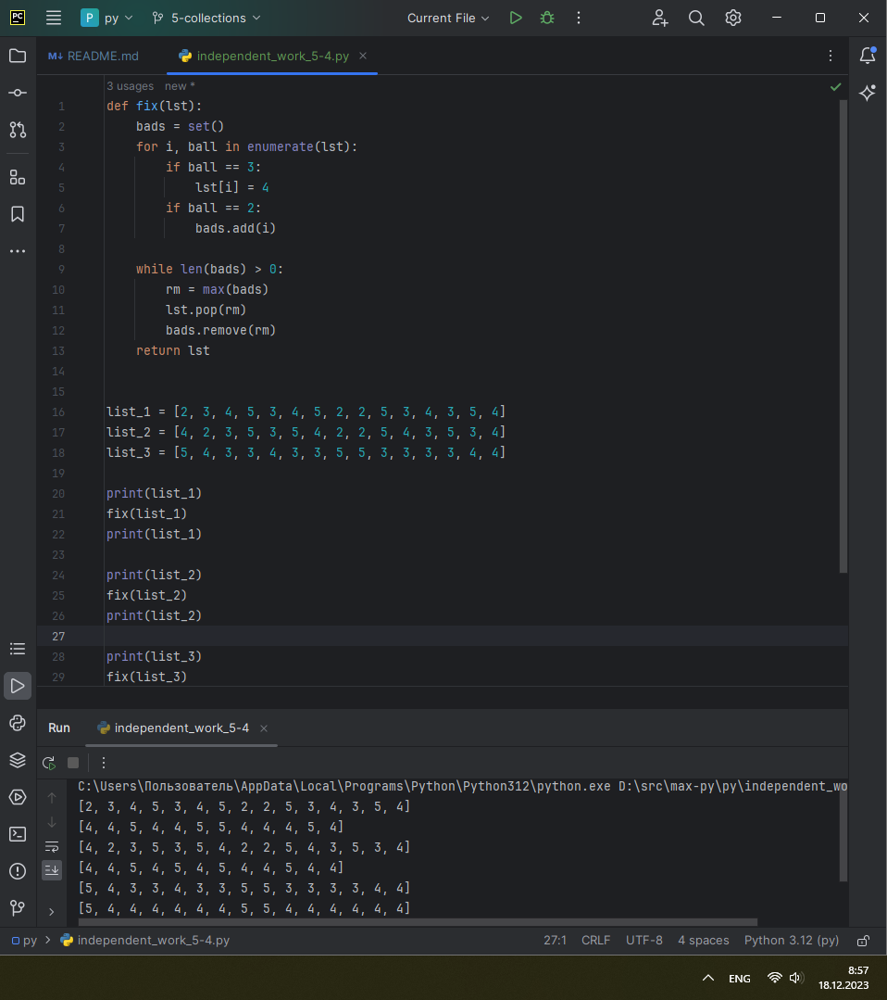
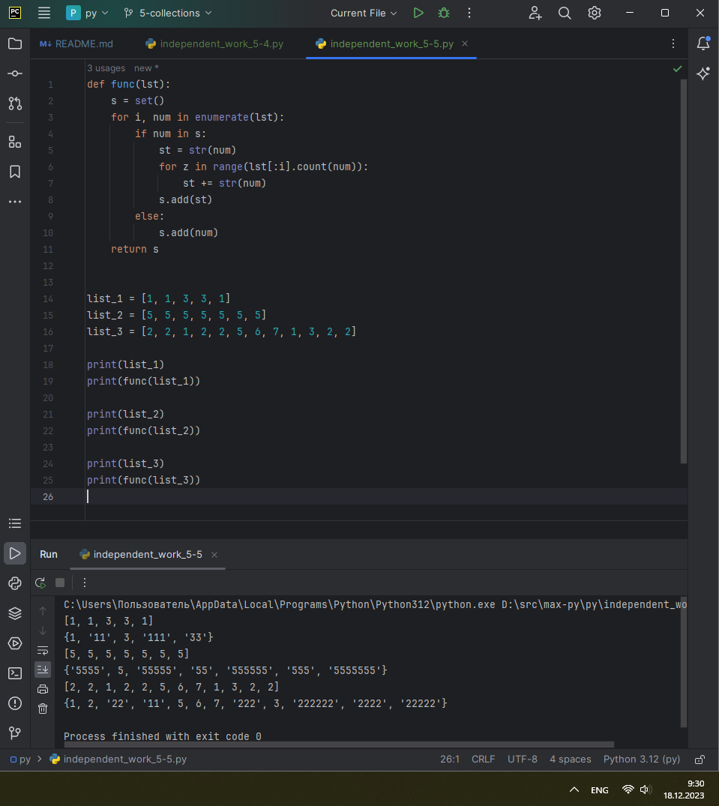

# ТЕМА 5. Базовые коллекции: множества, списки

| Задание     | лаб. раб. | сам. раб. |
|-------------|-----------|-----------|
| Задание 1   | +         | +         |
| Задание 2   | +         | +         |
| Задание 3   | +         | +         |
| Задание 4   | +         | +         |
| Задание 5   | +         | +         |
| Задание 6   | +         |           |
| Задание 7   | +         |           |
| Задание 8   | +         |           |
| Задание 9   | +         |           |
| Задание 10  | +         |           |

Отчет по Теме #5 выполнил:
* Василько Максим Викторович
* ОЗИВТ-22-1-у

## Лабораторная работа №1
_Друзья предложили вам поиграть в игру “найди отличия и убери
повторения (версия для программистов)”. Суть игры состоит в том, что
на вход программы поступает два множества, а ваша задача вывести
все элементы первого, которых нет во втором. А вы как раз недавно
прошли множества и знаете их возможности, поэтому это не составит
для вас труда.
P.S. Посмотрите что происходит с повторяющимися значениями в
множествах, это достаточно интересно._



_На скриншоте ниже приведен пример с разными видами повторений в
множествах_



## Лабораторная работа №2
_Напишите две одинаковые программы, только одна будет использовать
set(), а вторая frozenset() и попробуйте к исходному множеству
добавить несколько элементов, например, через цикл.
Вариант с set():_



_А вот что произойдет, если вы попробуете добавить новый элемент в
frozenset():_



## Лабораторная работа №3
_На вход в программу поступает список (минимальной длиной 2
символа). Напишите программу, которая будет менять первый и
последний элемент списка.
P.S. В Python есть прикольное свойство, благодаря которому эту задачу
можно решить более красиво, использовав всего 2 сточки кода, если
интересно можете самостоятельно найти это решение._


## Лабораторная работа №4
_На вход в программу поступает список (минимальной длиной 10
символов). Напишите программу, которая выводит элементы с
индексами от 2 до 6. В программе необходимо использовать “срез”._


## Лабораторная работа №5
_Иван задумался о поиске «бесполезного» числа, полученного из
списка. Суть поиска в следующем: он берет произвольный список
чисел, находит самое большое из них, а затем делит его на длину
списка. Студент пока не придумал, где может пригодиться подобное
значение, но ищет у вас помощи в реализации такой функции useless()._


## Лабораторная работа №6
_Ребята не могут определится каким супергероем они хотят стать. У них
есть случайно составленный список супергероев, и вы должны
определить кто из ребят будет каким супергероем. Необходимо
использовать разделение списков._


## Лабораторная работа №7
_Вовочка, насмотревшись передачи “Слабое звено” решил написать
программу, которая также будет находить самое слабое звено
(минимальный элемент) и удалять его, только делать он это хочет не с
людьми, а со списком. Помогите Вовочке с реализацией программы.
Подсказка: для этого вам необходимо отсортировать список и удалить
значение при помощи pop()._


## Лабораторная работа №8
_Михаил решил создать большой n-мерный список, для этого он
случайным образом создал несколько списков, состоящих минимум из
3, а максимум из 10 элементов и поместил их в один большой список.
Он также как и Иван не знает зачем ему это сейчас нужно, но надеется
на то, что это пригодится ему в будущем._


## Лабораторная работа №9
_Вы работаете в ресторане и отвечает за статистику покупок, ваша
задача сравнить между собой заказы покупателей, которые указаны в
разном порядке. Реализуйте функцию superset(), которая принимает 2
множества. Результат работы функции: вывод в консоль одного из
сообщений в зависимости от ситуации:_
* _1 - «Супермножество не обнаружено»_
* _2 – «Объект {X} является чистым супермножеством»_
* _3 – «Множества равны»_


## Лабораторная работа №10
_Предположим, что вам нужно разобрать стопку бумаг, но нужно
начать работу с нижней, “переверните стопку”. Вам дан произвольный
список. Представьте его в обратном порядке. Программа должна
занимать не более двух строк в редакторе кода._


## Самостоятельная работа №1
_Ресторан на предприятии ведет учет посещений за неделю при помощи
кода работника. У них есть список со всеми посещениями за неделю.
Ваша задача почитать:_
* _Сколько было выдано чеков_
* _Сколько разных людей посетило ресторан_
* _Какой работник посетил ресторан больше всех раз_

_Список выданных чеков за неделю:_
_[8734, 2345, 8201, 6621, 9999, 1234, 5678, 8201, 8888, 4321, 3365,
1478, 9865, 5555, 7777, 9998, 1111, 2222, 3333, 4444, 5556, 6666,
5410, 7778, 8889, 4445, 1439, 9604, 8201, 3365, 7502, 3016, 4928,
5837, 8201, 2643, 5017, 9682, 8530, 3250, 7193, 9051, 4506, 1987,
3365, 5410, 7168, 7777, 9865, 5678, 8201, 4445, 3016, 4506, 4506]_

_Результатом выполнения задачи будет: листинг кода, и вывод в
консоль, в котором будет указана вся необходимая информация._

```
checks = [8734, 2345, 8201, 6621, 9999, 1234, 5678, 8201, 8888, 4321, 3365, 1478, 9865, 5555, 7777, 9998, 1111, 2222,
          3333, 4444, 5556, 6666, 5410, 7778, 8889, 4445, 1439, 9604, 8201, 3365, 7502, 3016, 4928, 5837, 8201, 2643,
          5017, 9682, 8530, 3250, 7193, 9051, 4506, 1987, 3365, 5410, 7168, 7777, 9865, 5678, 8201, 4445, 3016, 4506,
          4506]
employers = [
    ['ivanov', set()],
    ['petrov', set()],
    ['sidorov', set()],
    ['mendeleev', set()],
    ['pushkin', set()],
    ['lermontov', set()],
    ['esenin', set()],
    ['dostoevsky', set()],
    ['fisher', set()]
]

visits = [
    [1,  # уникальный работника
     10000,  # уникальный код посетителя,
     0  # день недели
     ],
    [1,  # уникальный работника
     10001,  # уникальный код посетителя,
     1  # день недели
     ],
    [1,  # уникальный работника
     10002,  # уникальный код посетителя,
     2  # день недели
     ],
    [8,  # уникальный работника
     10002,  # уникальный код посетителя,
     3  # день недели
     ],
]


set_visitors = set()

for rec in visits:
    emp = rec[0]
    cli = rec[1]
    day = rec[2]
    set_visitors.add(emp)
    set_visitors.add(cli)
    employers[emp][1].add(day)

maxv = 0
maxf = ""
for emp in employers:
    fam = emp[0]
    days = emp[1]
    if len(days) > maxv:
        maxv = len(days)
        maxf = fam


print(f"Сколько было выдано чеков - {len(checks)}")
print(f"Сколько разных людей посетило ресторан - {len(set_visitors)}")
print(f"Какой работник посетил ресторан больше всех раз - {maxf}")
```


### _Результат:_


### _Выводы:_
_В данном коде кол-во выданных чеков определяется длиной списка с номерами чеков, количество поситивших ресторан (и работники и посетители учитывются согласно заданию, раз не было сказано иного) - определяется длиной множества set_visitors, которое заполняется в коде программы. Какой работник посетил ресторан больше всех раз определяется путем наличия максимального множества из дней недели по каждому сотруднику. Структура данных посещения предлагаеся в виде списка из: уникального кода работника, уникального кода посетителя, дня недели (0-6)_


## Самостоятельная работа №2
_На физкультуре студенты сдавали бег, у преподавателя физкультуры
есть список всех результатов, ему нужно узнать_
* _Три лучшие результата_
* _Три худшие результата_
* _Все результаты начиная с 10_
_Ваша задача помочь ему в этом.
Список результатов бега:
[10.2, 14.8, 19.3, 22.7, 12.5, 33.1, 38.9, 21.6, 26.4, 17.1, 30.2, 35.7, 16.9,
27.8, 24.5, 16.3, 18.7, 31.9, 12.9, 37.4]
Результатом выполнения задачи будет: листинг кода, и вывод в
консоль, в котором будет указана вся необходимая информация._

```
runs = [10.2, 14.8, 19.3, 22.7, 12.5, 33.1, 38.9, 21.6, 26.4, 17.1, 30.2, 35.7, 16.9,
        27.8, 24.5, 16.3, 18.7, 31.9, 12.9, 37.4]

runs_top = runs.copy()
print(f"Три лучшие результата: {runs_top.pop(runs_top.index(min(runs_top)))} сек., "
      f"{runs_top.pop(runs_top.index(min(runs_top)))} сек., "
      f"{runs_top.pop(runs_top.index(min(runs_top)))} сек.")

runs_low = runs.copy()
print(f"Три худщие результата: {runs_low.pop(runs_low.index(max(runs_low)))} сек., "
      f"{runs_low.pop(runs_low.index(max(runs_low)))} сек., "
      f"{runs_low.pop(runs_low.index(max(runs_low)))} сек.")

print(runs[10:])
```

### _Результат:_


### _Выводы:_
_В данном случае используется копирование списка, и уже последующие манипуляции для вычисления наилучших и наихудших результатов производятся над копией, потому что в последнем действии необходимо выполнить вывод на экран последних десяти результатов оригинального списка, а в ходе вычисления мин. и макс значений в коде просходит изменение списка - а именно командой pop из списка по его индексу исключаются значения_

## Самостоятельная работа №3
_Преподаватель по математике придумал странную задачку. У вас есть
три списка с элементами, каждый элемент которых – длина стороны
треугольника, ваша задача найти площади двух треугольников,
составленные из максимальных и минимальных элементов полученных
списков. Результатом выполнения задачи будет: листинг кода, и вывод
в консоль, в котором будут указаны два этих значения.
Три списка:
one = [12, 25, 3, 48, 71]
two = [5, 18, 40, 62, 98]
three = [4, 21, 37, 56, 84]_

```
from heron import square

one = [12, 25, 3, 48, 71]
two = [5, 18, 40, 62, 98]
three = [4, 21, 37, 56, 84]

triangle1 = [min(one), min(two), min(three)]
triangle2 = [max(one), max(two), max(three)]

print(f"Площадь треугольника 1 со сторонами {triangle1[0]}, {triangle1[1]} и {triangle1[2]} = {square(triangle1[0],
      triangle1[1], triangle1[2])}")
print(f"Площадь треугольника 2 со сторонами {triangle2[0]}, {triangle2[1]} и {triangle2[2]} = {square(triangle2[0],
      triangle2[1], triangle2[2])}")
```

### _Результат:_


### _Выводы:_
_В данном коде подсчет площади треугольника реализован посредством имортра функции square, реализованной в прошлой лабораторной работе_

## Самостоятельная работа №4
_Никто не любит получать плохие оценки, поэтому Борис решил это
исправить. Допустим, что все оценки студента за семестр хранятся в
одном списке. Ваша задача удалить из этого списка все двойки, а все
тройки заменить на четверки.
Списки оценок (проверить работу программы на всех трех вариантах):
[2, 3, 4, 5, 3, 4, 5, 2, 2, 5, 3, 4, 3, 5, 4]
[4, 2, 3, 5, 3, 5, 4, 2, 2, 5, 4, 3, 5, 3, 4]
[5, 4, 3, 3, 4, 3, 3, 5, 5, 3, 3, 3, 3, 4, 4]
Результатом выполнения задачи будет: листинг кода, и вывод в
консоль, в котором будут три обновленных массива._

```
def fix(lst):
    bads = set()
    for i, ball in enumerate(lst):
        if ball == 3:
            lst[i] = 4
        if ball == 2:
            bads.add(i)

    while len(bads) > 0:
        rm = max(bads)
        lst.pop(rm)
        bads.remove(rm)
    return lst


list_1 = [2, 3, 4, 5, 3, 4, 5, 2, 2, 5, 3, 4, 3, 5, 4]
list_2 = [4, 2, 3, 5, 3, 5, 4, 2, 2, 5, 4, 3, 5, 3, 4]
list_3 = [5, 4, 3, 3, 4, 3, 3, 5, 5, 3, 3, 3, 3, 4, 4]

print(list_1)
fix(list_1)
print(list_1)

print(list_2)
fix(list_2)
print(list_2)

print(list_3)
fix(list_3)
print(list_3)
```

### _Результат:_


### _Выводы:_
_В данном коде в функции преобразования вначале заменяются все тройки на четверки, и при этом при проходе по списку в множесвто bads фиксируются индексы двоек, а затем из множества каждый раз берется максимальное значение, до тех пор пока множество не станет пустым, и из списка удаляется элемент который соотвествует взятому из множества значению. После этого из множества исключается взятое значение. Максимальное значение берется для того, чтобы при удалении не перестраивались каждый раз индексы и код правильно работал._

## Самостоятельная работа №5
_Вам предоставлены списки натуральных чисел, из них необходимо
сформировать множества. При этом следует соблюдать это правило:
если какое-либо число повторяется, то преобразовать его в строку по
следующему образцу: например, если число 4 повторяется 3 раза, то в
множестве будет следующая запись: само число 4, строка «44», строка
«444».
Множества для теста:_
* _list_1 = [1, 1, 3, 3, 1]_
* _list_2 = [5, 5, 5, 5, 5, 5, 5]_
* _list_3 = [2, 2, 1, 2, 2, 5, 6, 7, 1, 3, 2, 2]_


_Результаты вывода (порядок может отличаться, поскольку мы работаем
с set()):_
* _{'11', 1, 3, '33', '111'}_
* _{5, '5555', '555555', '55555', '555', '55', '5555555'}_
* _{'11', 1, 3, 2, 5, 6, '222222', '222', 7, '2222', '22222', '22'}._

```
def func(lst):
    s = set()
    for i, num in enumerate(lst):
        if num in s:
            st = str(num)
            for z in range(lst[:i].count(num)):
                st += str(num)
            s.add(st)
        else:
            s.add(num)
    return s


list_1 = [1, 1, 3, 3, 1]
list_2 = [5, 5, 5, 5, 5, 5, 5]
list_3 = [2, 2, 1, 2, 2, 5, 6, 7, 1, 3, 2, 2]

print(list_1)
print(func(list_1))

print(list_2)
print(func(list_2))

print(list_3)
print(func(list_3))
```

### _Результат:_


### _Выводы:_
_В данном коде выполнение задания достигается дополнением строковым предствалением значения столько раз, сколько на момент перебора оно уже встретилось ранее в списке._
