# ТЕМА 7. Работа с файлами (ввод, вывод)

| Задание     | лаб. раб. | сам. раб. |
|-------------|-----------|-----------|
| Задание 1   | +         | +         |
| Задание 2   | +         | +         |
| Задание 3   | +         | +         |
| Задание 4   | +         | +         |
| Задание 5   | +         | +         |
| Задание 6   | +         |           |
| Задание 7   | +         |           |
| Задание 8   | +         |           |
| Задание 9   | +         |           |
| Задание 10  | +         |           |

Отчет по Теме #7 выполнил:
* Василько Максим Викторович
* ОЗИВТ-22-1-у

## Лабораторная работа №1
_Составьте текстовый файл и положите его в одну директорию с
программой на Python. Текстовый файл должен состоять минимум из
двух строк._


## Лабораторная работа №2
_Напишите программу, которая выведет только первую строку из
вашего файла, при этом используйте конструкцию open()/close()._


## Лабораторная работа №3
_Напишите программу, которая выведет все строки из вашего файла в
массиве, при этом используйте конструкцию open()/close()._


## Лабораторная работа №4
_Напишите программу, которая выведет все строки из вашего файла в
массиве, при этом используйте конструкцию with open()._


## Лабораторная работа №5
_Напишите программу, которая выведет каждую строку из вашего
файла отдельно, при этом используйте конструкцию with open()._


## Лабораторная работа №6
_Напишите программу, которая будет добавлять новую строку в ваш
файл, а потом выведет полученный файл в консоль. Вывод можно
осуществлять любым способом. Обязательно проверьте сам файл,
чтобы изменения в нем тоже отображались._

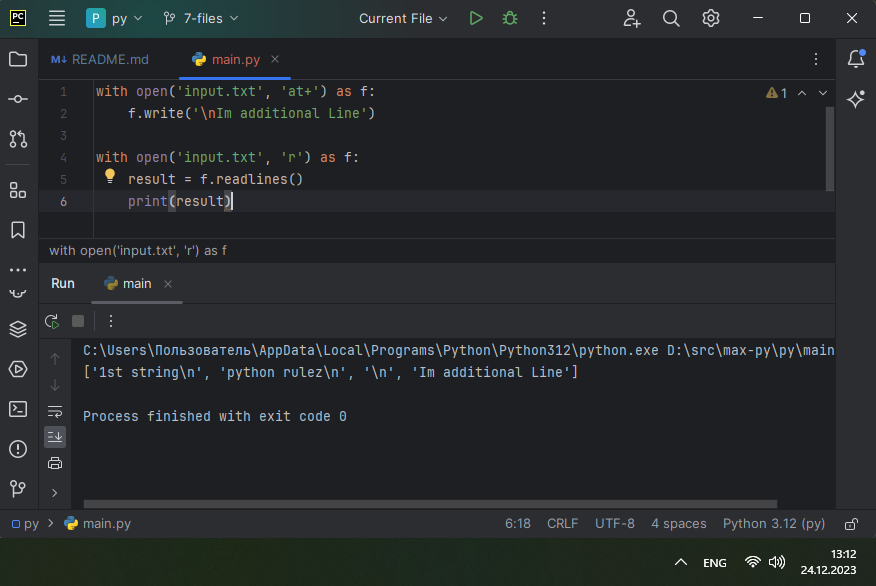
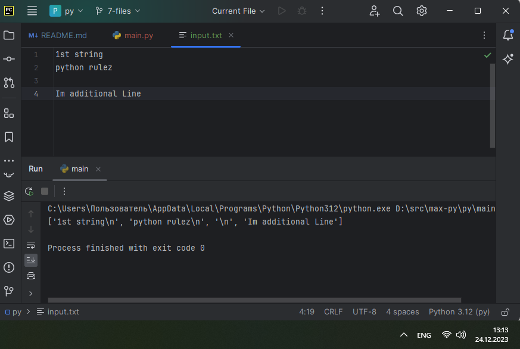

## Лабораторная работа №7
_Напишите программу, которая перепишет всю информацию, которая
была у вас в файле до этого, например напишет любые данные из
произвольно вами составленного списка. Также не забудьте проверить
что измененная вами информация сохранилась в файле._

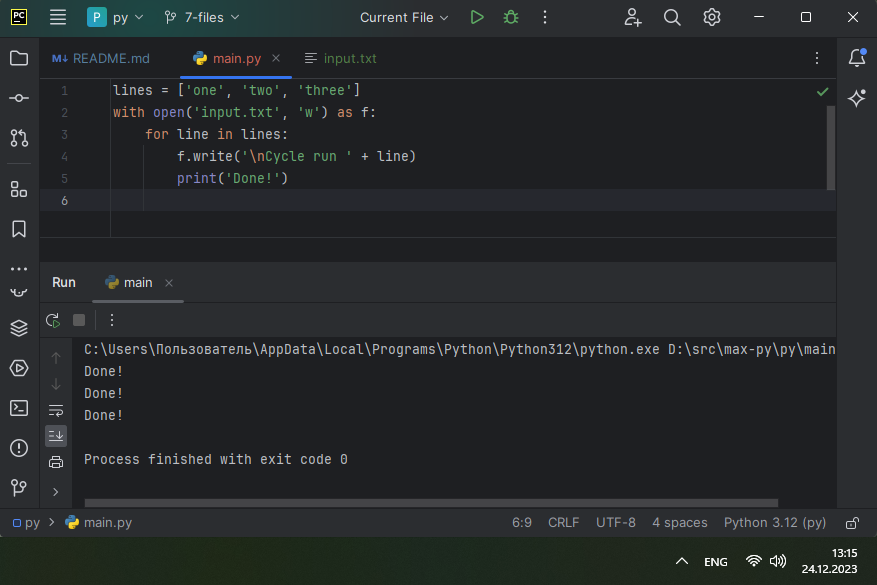
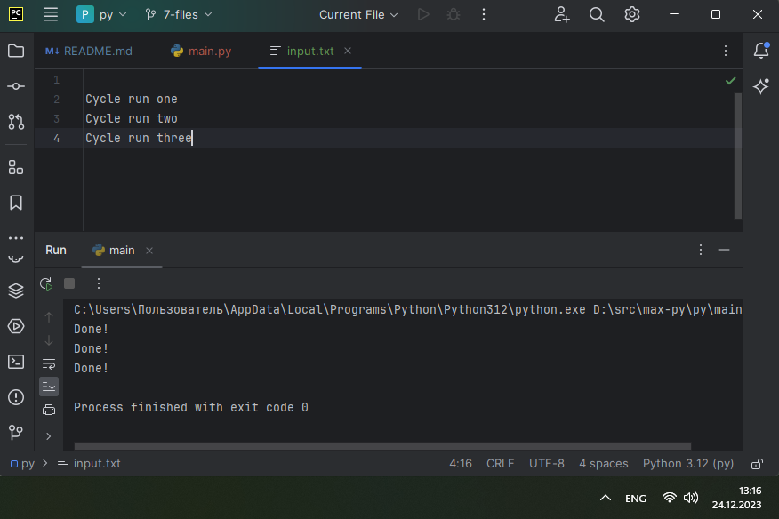

## Лабораторная работа №8
_Выберите любую папку на своем компьютере, имеющую вложенные
директории. Выведите на печать в терминал ее содержимое, как и всех
подкаталогов при помощи функции print_docs(directory)._


## Лабораторная работа №9
_Документ «input.txt» содержит текст. Требуется реализовать функцию, которая выводит слово, имеющее
максимальную длину (или список слов, если таковых несколько).
Проверьте работоспособность программы на своем наборе данных_


## Лабораторная работа №10
_Требуется создать csv-файл «rows_300.csv» со следующими столбцами:_
* _№ - номер по порядку (от 1 до 300);_
* _Секунда – текущая секунда на вашем ПК;_
* _Микросекунда – текущая миллисекунда на часах._

_Для наглядности на каждой итерации цикла искусственно приостанавливайте скрипт на 0,01 секунды._

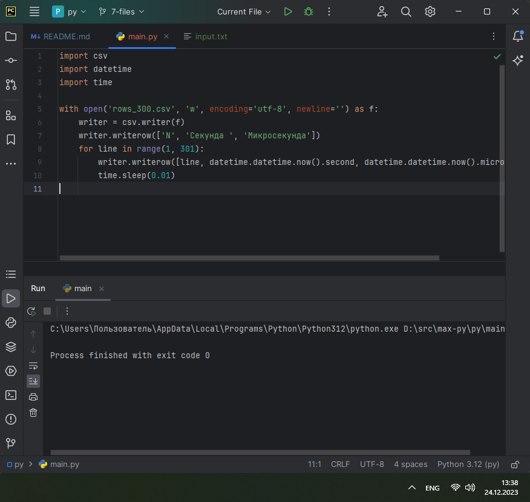
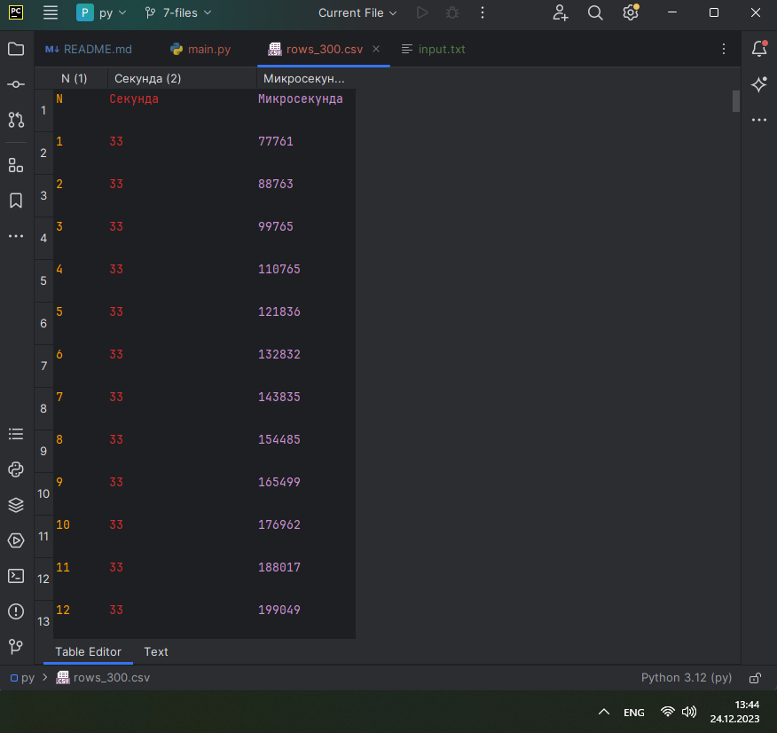


## Самостоятельная работа №1
_Найдите в интернете любую статью (объем статьи не менее 200
слов), скопируйте ее содержимое в файл и напишите программу,
которая считает количество слов в текстовом файле и определит
самое часто встречающееся слово. Результатом выполнения задачи
будет: скриншот файла со статьей, листинг кода, и вывод в консоль,
в котором будет указана вся необходимая информация_

```
import re

words_q = {}
words = []

with open('article.txt') as f:
    lines = f.readlines()
    for line in lines:
        for word in line.split():
            w = word.lower()
            w = re.sub(r'[,.!?\'\"]$', '', w)
            w = re.sub(r'^[\'\"]', '', w)
            words.append(w)

for word in words:
    words_q.update({word: words.count(word)})

frequent = sorted(words_q.items(), key=lambda x: -x[1])

print(f"Всего слов в статье: {len(words)}\nСамое часто встречающееся слово - \"{frequent[0][0]}\" ({frequent[0][1]} раз)")
```


### _Результат:_
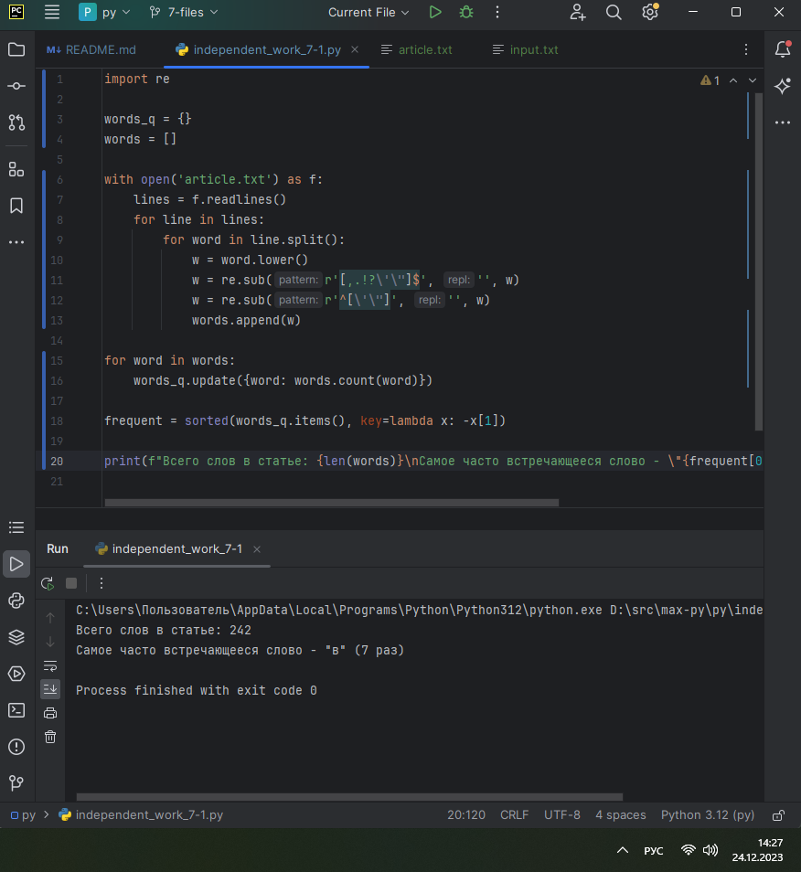

### _Выводы:_
_В данном коде происходит считывание файла article.txt, все встречающиеся слова добавляются в список, но прежде проходят обработку, чтобы не имели значения знаки препинания и заглавные буквы - все слова приводятся к нижнему регистру, а так же путем использования регулярных выражений исключаются возможные начальные и конечные кавычки, а так же возможные знаки препинания на конце, такие как запятая, точка, восклицательный и вопросительный знаки. Далее мы имеем список слов. И итерируясь по нему заполняем словарь, где слово является ключем, а значение это кол-во раз, сколько слово встречается в статье. Далее идет сортировка словаря по значению по убыванию с преобразованием в список. И в консоль мы выводим кол-во слов(длина списка) и самое часто встречающееся слово (первый элемент из подготовленного списка) - слово и количество его повторений._


## Самостоятельная работа №2
_У вас появилась потребность в ведении книги расходов, посмотрев
все существующие варианты вы пришли к выводу что вас ничего не
устраивает и нужно все делать самому. Напишите программу для
учета расходов. Программа должна позволять вводить информацию
о расходах, сохранять ее в файл и выводить существующие данные в
консоль. Ввод информации происходит через консоль. Результатом
выполнения задачи будет: скриншот файла с учетом расходов,
листинг кода, и вывод в консоль, с демонстрацией
работоспособности программы._

```
s = float(input("Введите сумму затрат (в рублях): "))

f = open("expenses.txt", "a")
f.write("Сумма затрат - " + str(s) + " руб.")
f.close()
```

### _Результат:_
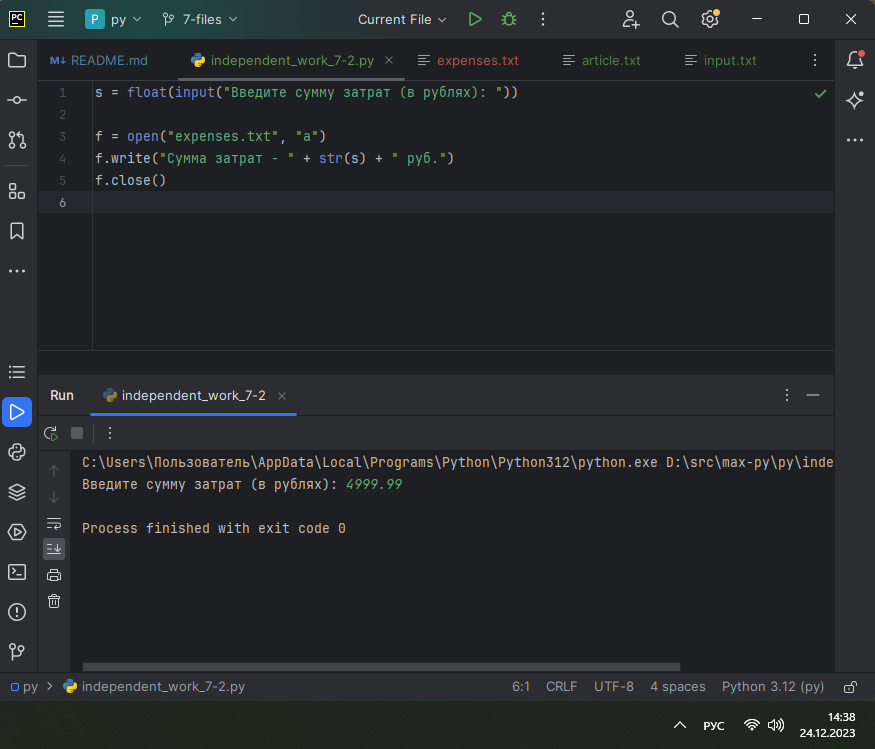
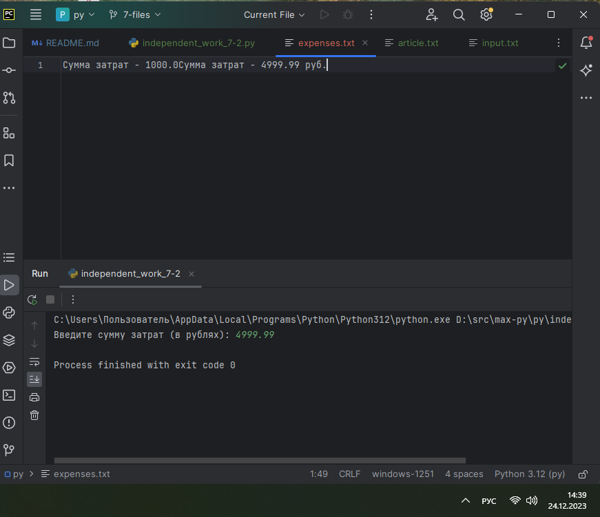

### _Выводы:_
_В данном коде на вход подается значение, введенное пользователем. Программа записывает в файл строку с содержанием введенных данных._

## Самостоятельная работа №3
_Имеется файл input3.txt с текстом на латинице. Напишите программу,
которая выводит следующую статистику по тексту: количество букв
латинского алфавита; число слов; число строк._

```
import re

w = []
chars = 0
with open('input3.txt') as f:
    lines = f.readlines()
    for line in lines:
        for word in line.split():
            w.append(word)
            weng = re.sub(r'[^a-zA-Z]*', '', word)
            chars += len(weng)

    print(f"{chars} letters")
    print(f"{len(w)} words")
    print(f"{len(lines)} lines")
```

### _Результат:_
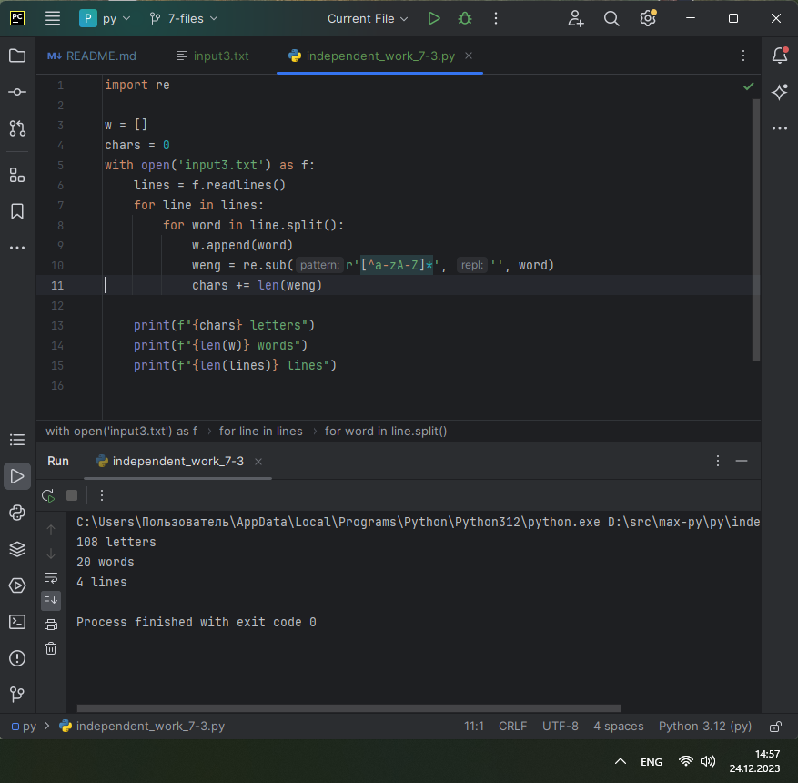

### _Выводы:_
_В данном коде происходит считывание из файла input3.txt, количество строк определяется длиной списка строк, количество слов - длина формируемого списка из слов, а количество символов подсчитывается в ходе выполнения программы, при этом используя регулярные выражения, мы подсчитываем только английские буквы, как того требует задание. Регулярное выражение убирает все остатеное, в данном случае точки на конце предложения._

## Самостоятельная работа №4
_Напишите программу, которая получает на вход предложение,
выводит его в терминал, заменяя все запрещенные слова
звездочками * (количество звездочек равно количеству букв в
слове). Запрещенные слова, разделенные символом пробела,
хранятся в текстовом файле input.txt. Все слова в этом файле
записаны в нижнем регистре. Программа должна заменить
запрещенные слова, где бы они ни встречались, даже в середине
другого слова. Замена производится независимо от регистра: если
файл input.txt содержит запрещенное слово exam, то слова exam,
Exam, ExaM, EXAM и exAm должны быть заменены на ****._
* _Запрещенные слова:
hello email python the exam wor is_
* _Предложение для проверки:
Hello, world! Python IS the programming language of thE future. My EMAIL is.... PYTHON is awesome!!!!_
* _Ожидаемый результат:
*****, ***ld! ****** ** *** programming language of *** future. My ***** **.... ****** ** awesome!!!!_

```
test_txt_orig = "Hello, world! Python IS the programming language of thE future. My EMAIL is.... PYTHON is awesome!!!!"
print(test_txt_orig)

test_txt = test_txt_orig.lower()

with open('input4.txt') as f:
    badline = f.readline()
    blacklist = badline.split()

    for word in blacklist:
        patch = ""
        for a in word:
            patch += '*'
        test_txt = test_txt.replace(word, patch)

new_txt = ""
for idx in range(len(test_txt_orig)):
    letter = test_txt[idx]
    if letter != '*':
        letter = test_txt_orig[idx]
    new_txt += letter

print(new_txt)
```

### _Результат:_


### _Выводы:_
_В данном коде выводится исходный текст, после чего он преобразуется весь к нижнему регистру. Далее из файла считывается и формируется черный список из слов, по этому списку итерируемся, формируем заменяющее слово, состоящее из того же кол-ва букв, что и запрешенное, но полностью состоящее из звездочек. далее делаем замену в тексте. После итерации всего черного списка, необхощимо восстановить регистр исходного текста. Для этого мы итерируемся по исходном тексту, и если символ не зведдочка, то восстанавливаем оригинальный символ. Таким образом получается что мы заменили необходимые слова не завимиио от регистра,  и при этом не потеряли орфограцию (соблюдение регистра) исходного сообщения._

## Самостоятельная работа №5
_Самостоятельно придумайте и решите задачу, которая будет
взаимодействовать с текстовым файлом._

_Запросите у пользователя любое число от 10 до 20. Далее создайте файл с именем число.py и с содержимым в виде исходного текста данного задания._
```
val = int(input("Введите число от 10 до 20: "))

if val < 10 or val > 20:
    print("Не соответствует")
else:
    f = open("independent_work_7-5.py")
    lines = f.readlines()
    f.close()
    f = open(f"{val}.py", "a")
    f.writelines(lines)
    f.close()
```

### _Результат:_
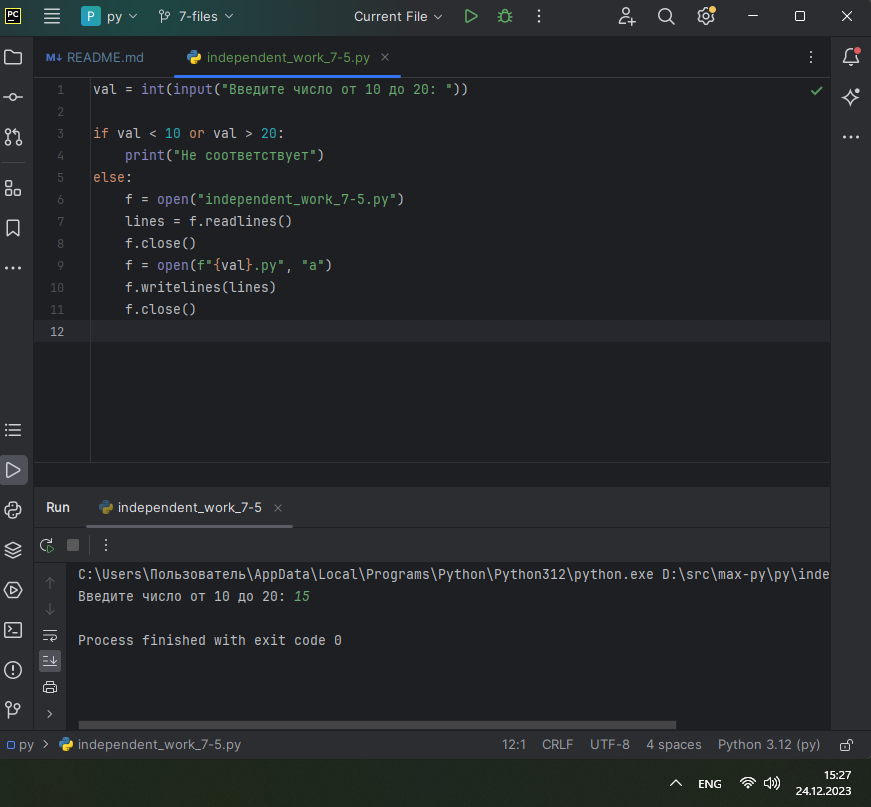
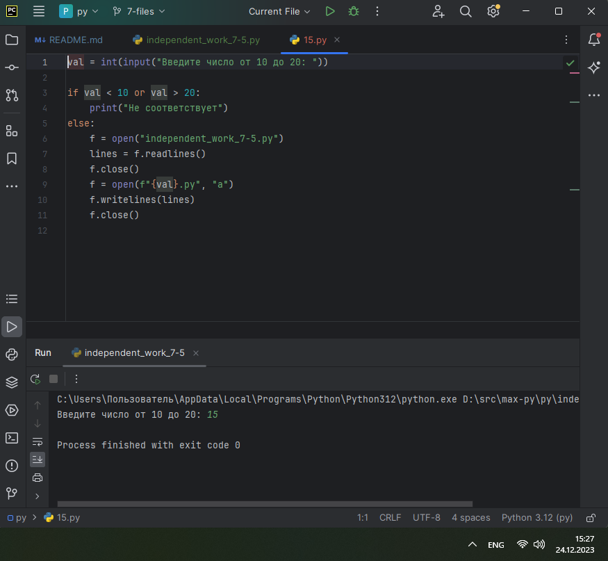 

### _Выводы:_
_В данном коде запрашиваем у пользователя число от 10 до 20, и если пользователь правильно ввел - то в переменную lines считывается содержимое файла с текущим заданием и сохраняется в файле с номером, введенными пользователем. На экране ниже показан файл 15.py, отображен краснысм т.к. был только что сформирован и не добавлен в гит_