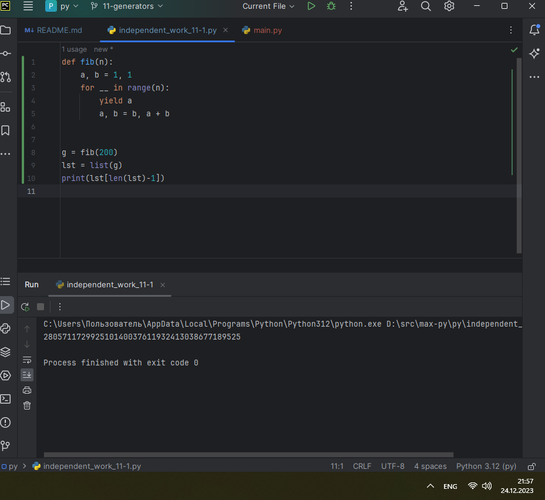
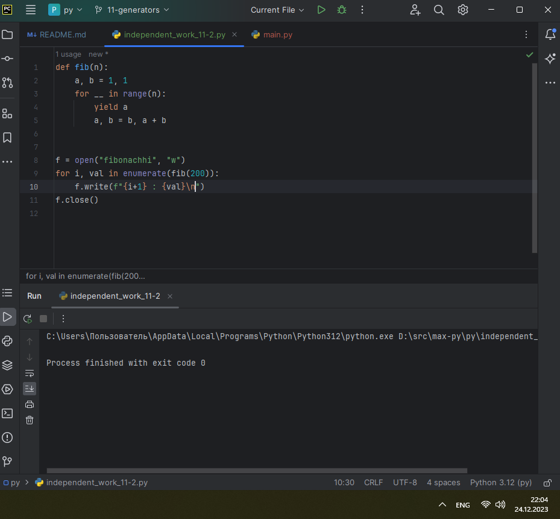
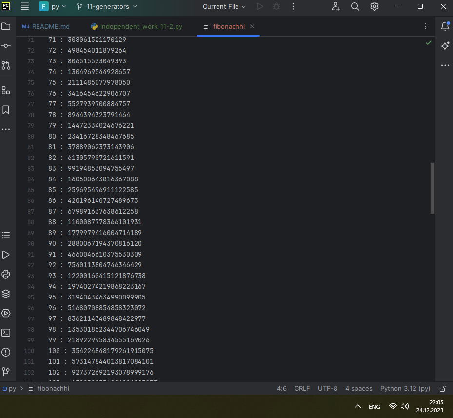

# ТЕМА 11. Итераторы и генераторы

| Задание     | лаб. раб. | сам. раб. |
|-------------|-----------|-----------|
| Задание 1   | +         | +         |
| Задание 2   | +         | +         |
| Задание 3   | +         |           |
| Задание 4   | +         |           |
| Задание 5   | +         |           |


Отчет по Теме #11 выполнил:
* Василько Максим Викторович
* ОЗИВТ-22-1-у

## Лабораторная работа №1
_Простой итератор, но у него нет гибкой настройки, например его
нельзя развернуть. Он работает просто как next(), но нет prev()_


## Лабораторная работа №2
_Класс итератор с гибкой настройкой и удобным применением_


## Лабораторная работа №3
_Генератор списка_


## Лабораторная работа №4
_Выражения генераторы_


## Лабораторная работа №5
_Такой же счетчик, как и в первом задании, только это генератор и
использует yield_


## Самостоятельная работа №1
_Вас никак не могут оставить числа Фибоначчи, очень уж они вас
заинтересовали. Изучив новые возможности Python вы решили
реализовать программу, которая считает числа Фибоначчи при
помощи итераторов. Расчет начинается с чисел 1 и 1. Создайте
функцию fib(n), генерирующую n чисел Фибоначчи с
минимальными затратами ресурсов. Для реализации этой функции
потребуется обратиться к инструкции yield (Она не сохраняет в
оперативной памяти огромную последовательность, а дает
возможность “доставать” промежуточные результаты по одному).
Результатом решения задачи будет листинг кода и вывод в консоль с
числом Фибоначчи от 200._

```
def fib(n):
    a, b = 1, 1
    for __ in range(n):
        yield a
        a, b = b, a + b


g = fib(200)
lst = list(g)
print(lst[len(lst)-1])
```


### _Результат:_


### _Выводы:_
_В данном коде реализован генератор для чисел фибоначи, и для вывода последнего числа генератор преобразуется в список и выводится последнее число из списка_


## Самостоятельная работа №2
_К коду предыдущей задачи добавьте запоминание каждого числа
Фибоначчи в файл “fib.txt”, при этом каждое число должно
находиться на отдельной строчке. Результатом выполнения задачи
будет листинг кода и скриншот получившегося файла._

```
def fib(n):
    a, b = 1, 1
    for __ in range(n):
        yield a
        a, b = b, a + b


f = open("fibonachhi", "w")
for i, val in enumerate(fib(200)):
    f.write(f"{i+1} : {val}\n")
f.close()
```

### _Результат:_


### _Выводы:_
_В данном коде в дополнение к прошлому заданию происходит работа с файлом fibonachhi: файл открывается для записи, после чего в цикле происходит запись данных, и после последней итерации файл закрывается._
