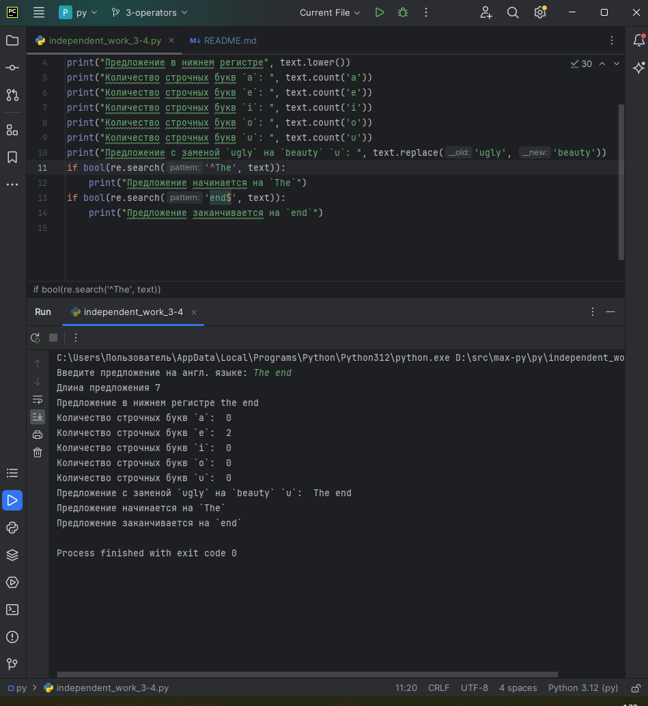
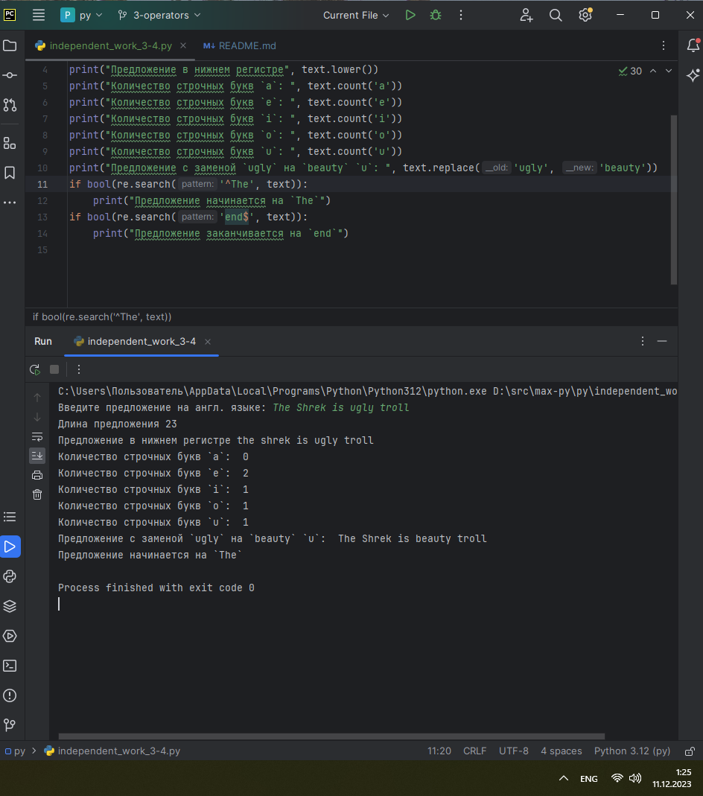
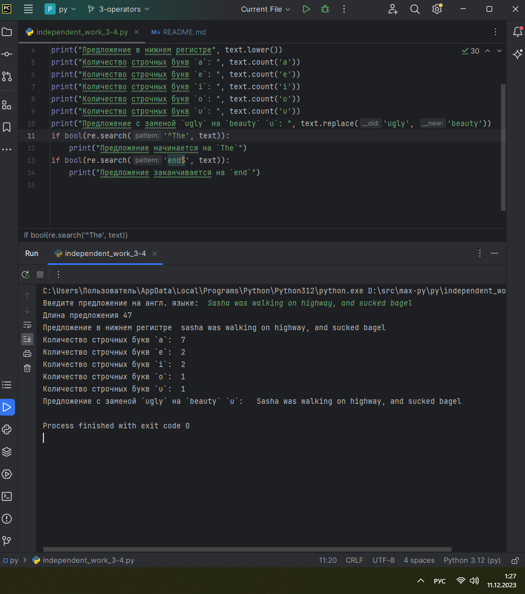
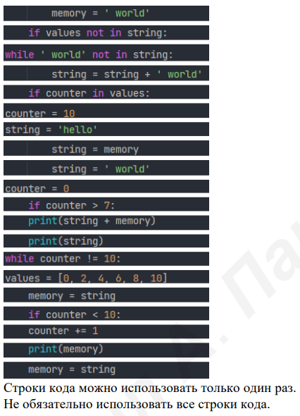

# ТЕМА 3. ОПЕРАТОРЫ, УСЛОВИЯ, ЦИКЛЫ

| Задание     | лаб. раб. | сам. раб. |
|-------------|-----------|-----------|
| Задание 1   | +         | +         |
| Задание 2   | +         | +         |
| Задание 3   | +         | +         |
| Задание 4   | +         | +         |
| Задание 5   | +         | +         |
| Задание 6   | +         |           |
| Задание 7   | +         |           |
| Задание 8   | +         |           |
| Задание 9   | +         |           |
| Задание 10  | +         |           |

Отчет по Теме #3 выполнил:
* Василько Максим Викторович
* ОЗИВТ-22-1-у

## Лабораторная работа №1
_Создайте две переменные, значение которых будете вводить через консоль. Также составьте условие, в котором созданные ранее переменные будут сравниваться, если условие выполняется, то выведете в консоль «Выполняется», если нет, то «Не выполняется»._


## Лабораторная работа №2
_Напишите программу, которая будет определять значения переменной меньше 0, больше 0 и меньше 10 или больше 10. Это нужно реализовать при помощи одной переменной, значение которой будет вводится через консоль, а также при помощи конструкций if, elif, else._


## Лабораторная работа №3
_Напишите программу, в которой будет проверяться есть ли переменная в указанном массиве используя логический оператор in. Самостоятельно посмотрите, как работает программа со значениями которых нет в массиве numbers._


## Лабораторная работа №4
_Напишите программу, которая будет определять находится ли переменная в указанном массиве и если да, то проверьте четная она или нет. Самостоятельно протестируйте данную программу с разными значениями переменной value_


## Лабораторная работа №5
_Напишите программу, которая будет определять находится ли переменная в указанном массиве и если да, то проверьте четная она или нет. Самостоятельно протестируйте данную программу с разными значениями переменной value_


## Лабораторная работа №6
_Напишите программу, в которой при помощи цикла for определяется есть ли переменная value в строке string и посмотрите, как работает оператор else для циклов. Самостоятельно посмотрите, что выведет программа, если значение переменной value оказалось в строке string._

_Определять индекс буквы не обязательно, но если вы хотите, то это делается при помощи строки: index = string.find(value) Вы берете название переменной, в которой вы хотите что-то найти, затем применяете встроенный метод find() и в нем указываете то, что вам нужно найти. Данная строка вернет индекс искомого объекта_


## Лабораторная работа №7
_Напишите программу, в которой вы наглядно посмотрите, как работает цикл for проходя в обратном порядке, то есть, к примеру не от 0 до 10, а от 10 до 0. В уже готовой программе показано вычитание из 100, а вам во время реализации программы будет необходимо придумать свой вариант применения обратного цикла._


## Лабораторная работа №8
_Напишите программу используя цикл while, внутри которого есть какие-либо проверки, но быть осторожным, поскольку циклы while при Михаил А. Панов неправильно написанных условиях могут становится бесконечными._


## Лабораторная работа №9
_Напишите программу с использованием вложенных циклов и одной проверкой внутри них. Самое главное, не забудьте, что нельзя использовать одинаковые имена итерируемых переменных, когда вы используете вложенные циклы_


## Лабораторная работа №10
_Напишите программу с использованием flag, которое будет определять есть ли нечетное число в массиве. В данной задаче flag выступает в роли индикатора встречи нечетного числа в исходном массиве, четных чисел._


## Самостоятельная работа №1
_Напишите программу, которая преобразует 1 в 31. Для выполнения поставленной задачи необходимо обязательно и только один раз использовать: **Цикл for**, ***= 5**, **+= 1**. Никаких других действий или циклов использовать нельзя_

```
value = 1
value *= 5
for i in range(26):
    value += 1
print(value)
```

### _Результат:_


### _Выводы:_
_В данном коде 1 преобразуется в 31 следующим путем: вначале единица умножается на 5, а затем в цикле 26 раз добавляется единица. Результат выводится на экран - это 31_

## Самостоятельная работа №2
_Напишите программу, которая фразу «Hello World» выводит в обратном порядке, и каждая буква находится в одной строке консоли. При этом необходимо обязательно использовать любой цикл, а также программа должна занимать не более 3 строк в редакторе кода._
```
s = "Hello World"
for i in range(len(s), 0, -1):
    print(s[i-1])
```
### _Результат:_


### _Выводы:_
_В данном коде решение обеспечивается путем обратного цикла - от количества символов строки до нуля, при этом в цикле последовательно выводится i-тый символ строки_

## Самостоятельная работа №3
_Напишите программу, на вход которой поступает значение из консоли, оно должно быть числовым и в диапазоне от 0 до 10 включительно (это необходимо учесть в программе). Если вводимое число не подходит по требованиям, то необходимо вывести оповещение об этом в консоль и остановить программу. Код должен вычислять в каком диапазоне находится полученное число. Нужно учитывать три диапазона:_
* _от 0 до 3 включительно_
* _от 3 до 6_
* _от 6 до 10 включительно_

```
value = int(input("Введите число от 0 до 10: "))
if value < 0 or value > 10:
    print("Нужно было ввести число от 0 до 10")
    exit(0)
if 3 >= value >= 0:
    print("было введено число в диапазоне 0...3")
elif value in [4,5]:
    print("было введено число в диапазоне 4...5")
else:
    print("было введено число в диапазоне 6+")
```

_Результатом работы программы будет выведенный в консоль диапазон. Программа должна занимать не более 10 строчек в редакторе кода_
### _Результат:_


### _Выводы:_
_В данном коде реализована валидация входного параметра с помощью условия. Диапазон введенного числа так же определяется условием._

## Самостоятельная работа №4
_Манипулирование строками. Напишите программу на Python, которая принимает предложение (на английском) в качестве входных данных от пользователя. Выполните следующие операции и отобразите результаты:_
* _Выведите длину предложения._ 
* _Переведите предложение в нижний регистр._ 
* _Подсчитайте количество гласных (a, e, i, o, u) в предложении._
* _Замените все слова "ugly" на "beauty"._
* _Проверьте, начинается ли предложение с "The" и заканчивается ли на "end"._

_Проверьте работу программы минимум на 3 предложениях, чтобы охватить проверку всех поставленных условий._

```
import re
text = str(input("Введите предложение на англ. языке: "))
print("Длина предложения", len(text))
print("Предложение в нижнем регистре", text.lower())
print("Количество строчных букв `a`: ", text.count('a'))
print("Количество строчных букв `e`: ", text.count('e'))
print("Количество строчных букв `i`: ", text.count('i'))
print("Количество строчных букв `o`: ", text.count('o'))
print("Количество строчных букв `u`: ", text.count('u'))
print("Предложение с заменой `ugly` на `beauty`: ", text.replace('ugly', 'beauty'))
if bool(re.search('^The', text)):
    print("Предложение начинается на `The`")
if bool(re.search('end$', text)):
    print("Предложение заканчивается на `end`")
```

### _Результат:_




### _Выводы:_

## Самостоятельная работа №5


```
string = 'hello'
memory = ' world'
values = [0, 2, 4, 6, 8, 10]
counter = 0
while counter != 10:
    if counter in values:
        print(string + memory)
        print(string)
    counter += 1
string = string + ' world'
memory = string
print(memory)
```
### _Результат:_

